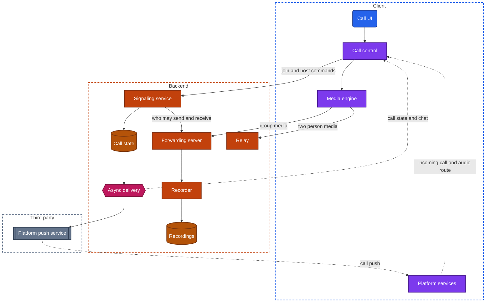
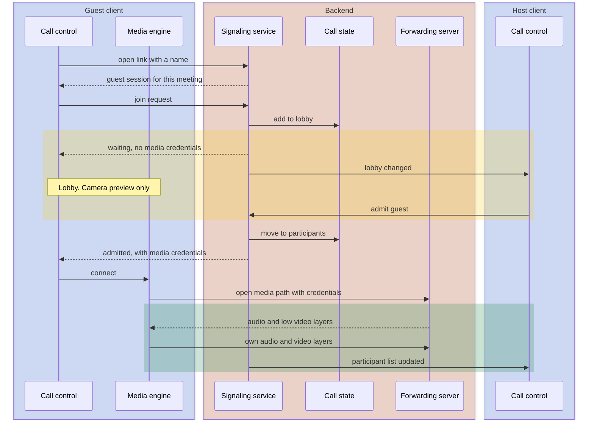

import Probe from '../../../components/Probe.astro';
import Signals from '../../../components/Signals.astro';
import TeardownBar from '../../../components/TeardownBar.astro';
import WorksheetForm from '../../../components/WorksheetForm.astro';

> **The archetype.** An app in which two people, a group or an audience talk live with sound and picture, started by a ring or by a link, with a host who decides who may enter and who may speak.

## 49.1 What defines this archetype

A calling app makes one promise. People hear and see each other with no noticeable delay, and a call survives a bad network.

Each clause costs something.

- **Hear and see each other.** Capture, encoding, transport and playing all run continuously on a phone, on battery, for an hour.
- **No noticeable delay.** Conversation breaks down above about four tenths of a second. Nothing may be buffered for long, so nothing can be sent twice.
- **Survives a bad network.** The network slows, drops and changes during the call. The call degrades in a chosen order and comes back by itself.

A fourth clause is implied. The call has to start. A ring must reach a phone whose app is not running, and a link must bring in a person who has no account and no app.

Four concerns dominate the design. Two more support them.

| Concern | Why it dominates | Chapter |
|---|---|---|
| Live calls | The media path and its servers are the product | [Chapter 19](/part-2-concerns/19-live-calls-and-live-streaming/) |
| Background work and notifications | A ring must wake a force-quit app, and a call must continue off screen | [Chapter 23](/part-2-concerns/23-background-work-and-notifications/) |
| Network resilience | Adaptation and reconnection decide whether a call is usable | [Chapter 13](/part-2-concerns/13-network-transport-and-resilience/) |
| Real-time delivery | Signaling, the participant list, chat and reactions travel beside the media | [Chapter 14](/part-2-concerns/14-real-time-delivery/) |
| Hardware | Microphone, camera and the audio route change during the call | [Chapter 24](/part-2-concerns/24-location-sensors-and-hardware/) |
| Deep links | A meeting is entered through a link | [Chapter 8](/part-2-concerns/8-navigation-deep-links-and-screen-state/) |

The archetype has three variants. They differ in how a call starts and in what stands on the media path.

| | One-to-one calls | Scheduled group meetings | Large broadcasts with few speakers |
|---|---|---|---|
| How it starts | A ring | A link, at an agreed time | A link, often with registration |
| Who is addressed | An account or a phone number | Anyone who holds the link | An audience |
| Media path | Direct, or through a relay | A forwarding server | A forwarding server for speakers, a live stream for viewers |
| End-to-end delay | Lowest | Low | Low for speakers, seconds for viewers |
| Who is in charge | Nobody | A host | A host and a few speakers |

This chapter uses three terms that the glossary does not hold yet. The **host** is the participant whose role lets them admit, mute and remove others. The **lobby** is the state of a participant who has asked to join and has not been admitted. The **participant list** is the backend's record of who is in a call, with each person's role and mute state.

## 49.2 Requirements read from the product

These are requirements as a participant experiences them. None of them names a design.

**What the app does**

- Ring another person's devices, with a full incoming-call screen, whether or not their app is running.
- Stop ringing everywhere when the call is answered, declined or abandoned.
- Join a meeting from a link, with an account, as a guest, or on a device that does not have the app.
- Show the other participants in a layout the viewer controls, with the current speaker marked.
- Share a screen. Send chat messages and reactions. Raise a hand.
- Keep the call going when the screen locks or another app is opened.
- Move the sound between earpiece, speaker and headset.
- Let a host hold people in a lobby, mute them, remove them and end the meeting.
- Record a meeting and make the recording available afterwards.

**Qualities it must have**

- Delay low enough that people do not talk over each other.
- No echo, including on speaker.
- Voice that stays understandable when the picture cannot.
- A call that continues across a network switch and returns after a short outage.
- A ring that arrives within a few seconds, and does not arrive after the caller gave up.
- Host decisions that a modified client cannot ignore.
- A battery cost that allows an hour of video.

Of the seven constraints of [Chapter 2](/part-1-method/2-the-mobile-constraint-set/), four bind hardest. Unreliable network shapes the media path. Platform rules decide whether a ring can start the app and whether a call may run in the background. Limited resources cap how many pictures a phone can decode. Untrusted client is the reason host controls live on the backend.

## 49.3 Running the probes

Most probes in this chapter need a second device, and several need a person who has agreed to help. Use your own second account where you can. When two devices of one call are in the same room, mute one of them, or the two will howl. [Chapter 4](/part-1-method/4-probes/) describes how to run a probe cleanly.

### Probes from Chapter 19

[Chapter 19](/part-2-concerns/19-live-calls-and-live-streaming/) holds the core probes. Run P19.1 to P19.7 on a call. Run P19.8 to P19.10 only on the viewer side of a broadcast.

| Probe | Typical outcome for this archetype | What it tells you |
|---|---|---|
| P19.1 Call delay, side by side | Barely noticeable | A deadline-oriented media path |
| P19.2 Echo | No echo, and both can speak at once | Echo cancellation, not a crude suppressor |
| P19.3 Degrade one side | The picture softens, then freezes, and the voice stays clear | An adaptation policy that protects audio |
| P19.4 Network switch mid-call | A freeze of a few seconds, then the call continues | The media path is set up again, and the backend holds the call meanwhile |
| P19.5 Call a force-quit app | A full incoming-call screen with a ringtone | A call push with the platform's calling integration |
| P19.6 Add participants | A brief freeze, or none | A move from direct media to a media server, or a media server from the start |
| P19.7 Enlarge a tile | You control the layout, and the enlarged picture sharpens | A forwarding server with quality layers |
| P19.8 Stream delay against a clock, as a broadcast viewer | A few seconds, or ten or more | Viewers receive a live stream, not the call |

### Probes from Chapters 23, 13 and 14

| Probe | Typical outcome | What it tells you |
|---|---|---|
| [P23.2](/part-2-concerns/23-background-work-and-notifications/) User-visible work, on a call | The call continues with a system indicator. The camera stops | A call is user-visible work, and the platform ends capture off screen |
| P23.3 Force-quit, then an event, for a chat message and for a call | A plainer message notification, and the same full call screen | The call push has higher priority than ordinary platform push |
| [P13.3](/part-2-concerns/13-network-transport-and-resilience/) Weak connection, on joining | A long "connecting" state that ends in the call | Signaling and the opening of the media path fail separately |
| [P14.8](/part-2-concerns/14-real-time-delivery/) Reconnect catch-up, on in-call chat | All messages appear in order | Chat is stored and has catch-up |
| P14.10 Ephemeral signal expiry, on a reaction | It disappears within seconds, and a disconnected device never sees it | Reactions are ephemeral signals |

### Probes from Chapters 8 and 24

Run the link probes of [Chapter 8](/part-2-concerns/8-navigation-deep-links-and-screen-state/) with a meeting link you created.

| Probe | Typical outcome | What it tells you |
|---|---|---|
| P8.5 Link while signed in | The app opens on the meeting's pre-join screen | A verified web link routed to the meeting |
| P8.7 Link into a running app | The pre-join screen is presented over your current place | The router keeps your place |
| P8.8 Link while signed out | The meeting is offered without a sign-in, or after one | A guest session, or a link kept through sign-in |
| P8.9 Link with the app not installed | A web page that joins the meeting, or the store and then the meeting | A web client, or a deferred deep link |

[Chapter 24](/part-2-concerns/24-location-sensors-and-hardware/) has no probe for audio routing. P49.8 fills that place. Its permission probes carry over: deny the camera and then the microphone, and note whether the app still lets you join as a listener.

### Calling probes

These eight probes are specific to the archetype. P49.1 examines the ring. P49.2 and P49.3 examine entry by link. P49.4 and P49.5 examine where host controls are decided. P49.6 examines chat, P49.7 an outage and P49.8 the audio route.

<TeardownBar />

### P49.1 Answer on one device

<Probe id="P49.1" />

### P49.2 Join by link without an account

<Probe id="P49.2" />

### P49.3 Join before the host

<Probe id="P49.3" />

### P49.4 Host mutes a participant

<Probe id="P49.4" />

### P49.5 Host loses the app

<Probe id="P49.5" />

### P49.6 Chat for a late joiner

<Probe id="P49.6" />

### P49.7 Outage and return

<Probe id="P49.7" />

### P49.8 Route change

<Probe id="P49.8" />

## 49.4 The design, concern by concern

Each subsection states the design this archetype usually takes and the reason. The components are those of the universal app model in [Chapter 3](/part-1-method/3-the-universal-app-model/).

### Two paths, and call state on the backend

A call has a signaling path and a media path, as [Chapter 19](/part-2-concerns/19-live-calls-and-live-streaming/) describes. The signaling path is ordinary real-time delivery through the backend. It carries small, reliable, ordered messages: ring, answer, join, leave, mute, admit. The media path carries sound and picture under a deadline, and a lost packet is not sent again.

The record that ties them together is the call state, and it lives on the backend. It holds the participant list, the role of each participant, who is in the lobby, whether a recording is running and which media server serves the call. No client holds the main copy, including the host's. P49.5 confirms it: a meeting that continues when the host's app is gone was never kept on the host's device.

The client has two matching components. Call control speaks to the signaling service and draws the call's UI from call state. The media engine owns capture, encoding, the playout buffer and the audio output.

### Group size selects the media route

The route for media is chosen by the number of participants and by what each of them does.

| Situation | Route | Why |
|---|---|---|
| Two people | Direct, with a relay as the fallback | Lowest delay and no backend traffic when it works |
| Three to some tens, all able to speak | A forwarding server with quality layers | One upload per device, a choice of quality per receiver |
| A participant on a telephone line, or a recording | A mixing server for that one output | One composed stream is needed |
| A few speakers and a large audience | A forwarding server for speakers, low-latency delivery or segmented delivery for viewers | Viewers send nothing, so they do not need a call |

```text
function chooseRoute(call):
  if call.participants.count == 2 and not call.recording:
    return tryDirect(fallback: Relay)
  if call.audience.count > interactiveLimit:
    return ForwardingServer(for: call.speakers) + LiveStream(for: call.audience)
  return ForwardingServer(layers: [low, medium, high])
```

Each row has a signature. P19.6 shows the move from the first row to the second, where an app makes one. P19.7 shows quality layers. P19.8, run as a viewer, shows the fourth row: the delay jumps from a fraction of a second to several seconds, and the viewer has no microphone control until a host promotes them.

As a meeting grows, a forwarding server sends less to each device. The client subscribes to video only for the tiles on screen, at a layer that fits the size of each tile. The server forwards audio for the few loudest speakers. The current speaker is marked from audio levels that the server reports to every client.

### The incoming call

A one-to-one call starts with a ring, and the ring has to reach an app with no process. The mechanism is the call push of [Chapter 19](/part-2-concerns/19-live-calls-and-live-streaming/): a high-priority platform push that starts the app in the background and lets it present the system's own incoming-call screen.

Platform rules bind it. The app must present a call promptly for every call push it receives. So the backend cannot use the mechanism for anything else, and it should not send one for a call that has already ended.

Ringing is state that is fanned out to every device of the callee, and each end of the ring needs a second message.

```text
function onAnswered(call, answeringDevice):
  call.state = Connecting
  for device in call.callee.devices:
    if device != answeringDevice:
      send(device, StopRinging(call.id, reason: AnsweredElsewhere))
  send(call.caller, Answered(call.id, addressesOf: answeringDevice))
```

P49.1 tests the stop message. A second device that keeps ringing after the answer did not receive it.

A scheduled meeting does not ring. Its reminder is a notification at the start time. That can be a local notification the client scheduled when the meeting was saved, or a platform push the backend sends. P23.8 in [Chapter 23](/part-2-concerns/23-background-work-and-notifications/) separates the two.

### Adapting as the network degrades

The media engine estimates what the network can carry several times per second and sets the encoder's rate. The adaptation policy protects audio, because audio needs a small fraction of what video needs and carries most of the meaning.

The order is the one in [Chapter 19](/part-2-concerns/19-live-calls-and-live-streaming/): lower video quality, lower resolution, lower frame rate, pause video, lower audio quality, and only then drop the call. P19.3 shows where an app stops on that ladder.

Two refinements belong to meetings.

- **Each receiver adapts alone.** With quality layers, the forwarding server sends a weak receiver the low layer of everyone. The other participants are not affected.
- **A shared screen has its own policy.** Text must stay sharp, so the engine keeps the resolution and cuts the frame rate. A shared screen that stays readable while its scrolling stutters shows the separate policy.

### Reconnection

Two things break when the network changes: the media route and the persistent connection that carries signaling. They recover separately.

The media engine gathers the device's new addresses, sends them through signaling, and agrees a new route with the other side or with the media server. The call control reconnects to the signaling service and catches up on the call state it missed. Meanwhile the backend keeps the participant in the call for a grace period, and tells the others only that the connection is poor.

```text
function onSignalingLost(participant, call):       // on the backend
  participant.state = Reconnecting
  after gracePeriod:
    if participant.state == Reconnecting:
      remove(participant, call)                    // others now see that they left
      if call.participants.count < 2 and call.kind == OneToOne: end(call)
```

Catch-up is by state, not by event. A client that returns after twenty seconds fetches the current participant list and the chat it missed. It does not replay every mute and unmute.

P19.4 covers the network switch. P49.7 covers the longer case, where the outage outlasts the grace period. The client then has to join again, and the design question is whether it does so by itself.

### Joining by link

A meeting link is a verified web link that names a meeting. It often carries a passcode as well, so that holding the link is enough to ask for entry. [Chapter 8](/part-2-concerns/8-navigation-deep-links-and-screen-state/) describes how such a link is routed. Four cases matter here.

| State of the device | Usual design | What you see |
|---|---|---|
| App installed, signed in | The router opens a pre-join screen | Camera preview, microphone switch, a join button |
| App installed, signed out | A guest session, created from a typed name | The meeting, with no account |
| App not installed | A web client in the browser, or a deferred deep link through the store | The meeting in a browser tab, or the store and then the meeting |
| Old app version | A forced-update gate, or a fallback to the web client | An update prompt before the meeting |

The guest session is the notable choice. A meeting product wants every invited person in the room, so it accepts an identity that is only a name. The backend still issues a session, scoped to that one meeting, because the signaling service and the media server need something to authorize. [Chapter 20](/part-2-concerns/20-identity-and-sessions/) covers sessions without credentials.

The link itself grants nothing. The backend decides on each join request, which is the subject of the next subsection.

### Lobby and host controls are decided by the backend

A client can be modified. If the lobby were a screen that the client agreed to show, a modified client would skip it. So every host control is a rule in the backend, applied at the two places a participant cannot avoid: the signaling service and the media server.

```text
function onJoinRequest(meeting, session):
  if session in meeting.removed: return Refused
  if meeting.locked: return Refused
  if not meeting.started and not session.isHost: return WaitForHost
  if meeting.lobbyEnabled and not session.isHost:
    meeting.lobby.add(session)
    notify(meeting.hosts, LobbyChanged)
    return Waiting                    // no media credentials are issued yet
  return Admitted(mediaCredentials(session, meeting))
```

The important line is the comment. A participant in the lobby holds no credentials for the media server. They cannot hear the meeting, whatever their client does.

Each control has a weak form and an enforced form.

| Control | Weak form | Enforced form |
|---|---|---|
| Lobby | The client shows a waiting screen | No media credentials until admitted |
| Mute | The backend asks the client to stop sending | The media server stops forwarding that participant's audio |
| Unmute | The host can unmute anyone | The host can only ask, and the participant must agree |
| Remove | The client is told to leave | The session is refused by signaling and by the media server, and cannot join again |
| End for all | Each client is told to leave | The call state is closed and the media server drops every stream |

Mute deserves a note. Most products do not let a host unmute a participant. A host who could switch on a microphone remotely would be a privacy problem, so the enforced form of unmute is a request. P49.4 shows which forms an app uses.

From outside you see the result and not the place of enforcement. A lobby that holds, a mute that the participant cannot undo and a removal that sticks are Observed. That the media server enforces them is Inferred from the fact that nothing else could.

### Screen sharing, chat and reactions

A shared screen is one more video stream from one participant, with the sharpness policy described earlier. On a phone, capturing the whole screen runs in a separate process that the platform starts, which is an extension in the terms of [Chapter 25](/part-2-concerns/25-platform-surfaces-widgets-wearables-and-extensions/). The platform shows a mandatory indicator while it runs.

The rest of what happens in a call travels on the signaling path, as the real-time delivery of [Chapter 14](/part-2-concerns/14-real-time-delivery/). The items differ in whether they are stored.

| Item | Kind | After a reconnect |
|---|---|---|
| Participant list, mute state, raised hand | State, held in call state | The current value is fetched |
| Chat message | Stored event with a sequence number | Missed messages arrive by catch-up |
| Reaction, speaking indicator | Ephemeral signal | Never seen |

A raised hand and a reaction look alike and are different. The hand is state: it stays up until lowered, and a late joiner sees it. The reaction is an ephemeral signal. P49.6 separates stored chat from live-only chat, and shows whether a meeting's chat outlives the meeting.

Chat arrives well under a second. In a broadcast, the viewers' picture is seconds behind, so chat runs ahead of what viewers see. P19.9 measures it.

### Recording on the backend

A forwarding server holds many separate streams and no finished picture. Two designs produce a recording.

- **A recorder joins the call.** A backend component subscribes to the streams like a participant, composes them and encodes one file. Some products show it in the participant list.
- **The streams are stored and composed later.** The media server writes each stream as it arrives, and a job builds the file after the meeting.

Either way the recording is backend work. It continues if the host's device leaves, it takes minutes of processing after the meeting ends, and it appears in the account on any device. Every participant sees a notice when it starts, which is a consent duty and a visible sign that call state changed.

The alternative is a recording made on one participant's device and saved there as a file. It stops when that device leaves. Media that is end-to-end encrypted forces this design, since a backend recorder would need the keys.

### Audio routing

During a call the sound has several possible routes: earpiece, speaker, a wired headset, a wireless headset, a car. The operating system arbitrates, as [Chapter 24](/part-2-concerns/24-location-sensors-and-hardware/) describes, and the app states a preference.

A well-built client does four things.

- It starts a voice call on the earpiece and a video call on the speaker.
- It follows the newest route. A headset that connects takes the sound, and its disconnection returns the sound to the earlier route.
- It uses the proximity sensor to switch the screen off at the ear.
- It tells the echo canceller which route is active, because speaker and headset need different handling.

An app that uses the platform's calling integration receives a system route picker and correct behavior when an ordinary phone call arrives: one call is held while the other is answered. An app that manages audio alone must handle each case itself. P49.8 shows how well it does.

### The call in the background

A call is user-visible work in the terms of [Chapter 23](/part-2-concerns/23-background-work-and-notifications/). The process keeps running while the call lasts, and the platform shows an indicator that returns the user to the call. Platform rules usually stop camera capture when the app leaves the screen. The other participants then see a frozen frame or an avatar. Incoming video can continue in a picture-in-picture window where the app supports it.

## 49.5 End-to-end architecture

Figure 49.1 shows the components that the probes imply for a group meeting on a forwarding server.



*Figure 49.1. The client and backend of a meeting app. The signaling service decides, and the forwarding server enforces.*

The arrow from the signaling service to the forwarding server carries the rules of Section 49.4: who is admitted, who is muted, which layers each receiver gets. The client has almost no local store. A call is the rare feature that is Level 0 in the terms of [Chapter 12](/part-2-concerns/12-offline-and-sync/), online only, by nature.

Figure 49.2 follows the flow that defines the meeting variant: a guest opens a link, waits in the lobby and is admitted. [Chapter 19](/part-2-concerns/19-live-calls-and-live-streaming/) draws the matching flow for a ring.



*Figure 49.2. A guest joins by link through the lobby. Media credentials are issued only on admission.*

## 49.6 Variants and how to tell them apart

The three variants of Section 49.1 are visible in the product. The designs inside each are settled by probes. [Chapter 5](/part-1-method/5-from-signal-to-inference/) describes how a signal becomes a claim with a confidence word.

| Question | Discriminating probe | Reading |
|---|---|---|
| Ring by call push or by ordinary push | P19.5 | A full call screen on a locked device, or a banner |
| Ring state fanned out with stop messages | P49.1 | Other devices stop, or keep ringing |
| Direct media for two, a server for more | P19.6 | A brief freeze when the third person joins |
| Forwarding or mixing | P19.7 | Layout under your control with tiles that sharpen, or one fixed picture |
| Viewers in the call or on a stream | P19.8, as a viewer | A fraction of a second, or several seconds |
| Guest session or account required | P49.2 | A name is enough, or a sign-in is demanded |
| Host controls enforced | P49.3 and P49.4 | The lobby holds and a mute cannot be undone |
| Call state on the backend | P49.5 | The meeting outlives the host's app |

**Calls against meetings.** A calling product is built around an identity and a ring. Its hard parts are the call push, the ringing state and a two-person media path. A meeting product is built around a link and a room. Its hard parts are entry without an account, the lobby and a forwarding server that serves many receivers.

**Meetings against broadcasts.** The difference is whether the audience is in the call. A viewer who can be promoted to speaker, with a pause of a second or two while it happens, was on a stream and has just been moved to the forwarding server.

**The honest limits.** Direct and relayed media cannot be told apart in a two-person call. The transport cannot be identified. Where a mute is enforced is Inferred, not Observed. A claim that media is end-to-end encrypted cannot be verified. You can record its consequences: no recording on the backend, no telephone participants and no captions produced by the backend. An app that claims it and still offers all three has contradicted itself.

<Signals chapter={49} />

## 49.7 What changes with scale

Scale has two meanings here: the size of one call, and the number of calls at once.

**The same at every size**

- A signaling path apart from the media path, with call state on the backend.
- A call push for the ring.
- An adaptation policy that protects audio.
- A grace period for reconnection.
- Host controls enforced by the backend.

**What changes with the size of one call**

- Two people use direct media or a relay. A third moves the call to a forwarding server.
- Tens of participants need quality layers, video only for visible tiles and audio for the loudest few.
- Hundreds need caps on who may send, and sometimes several forwarding servers that pass streams between them.
- Thousands of viewers leave the call and watch a live stream, carried by media delivery.

**What changes with the number of calls**

- **Placement.** A small product runs media servers in one region. A large one places each call on a server near its participants, and a call that spans continents is carried between regions on the backend's own network. Delay that is low for distant participants is a Speculative sign of this.
- **Recording.** Composing recordings is heavy processing. A large product queues it, and the wait between the end of a meeting and the recording grows at busy hours.
- **Failure.** When a media server fails, its calls must move. Participants see everyone freeze and return together, which differs from one person's network failing.

## 49.8 Completed worksheet

[Chapter 6](/part-1-method/6-the-teardown-worksheet/) describes the worksheet and the order in which to fill it in. The fields in this form are specific to meetings and calling. The probes of Section 49.3 fill most of them.

<TeardownBar />

<WorksheetForm chapters={[49]} />

The fields that the Part II chapters add to the worksheet take these typical values for a group meeting product. A value that differs in your teardown is a finding. Record it with the probe that produced it.

| Field | Typical value | Confidence |
|---|---|---|
| Call delay measured side by side, [Chapter 19](/part-2-concerns/19-live-calls-and-live-streaming/) | Under half a second | Observed |
| On a weak network | Video degrades and audio holds | Observed |
| Network switch mid-call | Brief freeze then continues | Observed |
| Incoming call with the app force-quit | Full call screen | Observed |
| Media path | Changes with group size | Inferred |
| Group call server | Forwarding with quality layers | Inferred |
| Long-running work in the background, [Chapter 23](/part-2-concerns/23-background-work-and-notifications/) | Continues with indicator | Observed |
| Catch-up on reconnect | In order without gaps, for chat | Observed |
| Ephemeral signals present, [Chapter 14](/part-2-concerns/14-real-time-delivery/) | Reactions and speaking indicators | Observed |
| Link while signed out, [Chapter 8](/part-2-concerns/8-navigation-deep-links-and-screen-state/) | Shown without a session, as a guest | Observed |
| Link with the app not installed | Web page with content, or deferred deep link | Observed |
| Offline level, [Chapter 12](/part-2-concerns/12-offline-and-sync/) | 0 Online only | Observed |
| Backend components implied | Signaling service, call state, async delivery, relay, forwarding server, recorder, platform push as a third party | Inferred |

## 49.9 As an interview question

The question is usually asked as "design a video calling app" or "design a meeting product". It tests whether you separate control from media and whether you know what a phone can and cannot do in the background.

**Clarify first.** Four questions decide most of the design.

1. How many participants, and how many of them speak. Two, tens, or a few speakers with an audience.
2. How a call starts. A ring to a known person, or a link to a room.
3. Whether recording, telephone participants or end-to-end encryption are required. The first two need the backend to read media, and the third forbids it.
4. Whether guests without an account may join.

Then state the promise from Section 49.1 with a number: end-to-end delay well under half a second.

**Go deep on three concerns.**

- **The two paths and the media route.** Signaling through the backend with call state there. Direct media or a relay for two, a forwarding server with quality layers for a group, a live stream for an audience. Draw Figure 49.1 and say which probe shows each choice.
- **Starting the call.** The call push, the incoming-call screen, ringing as fanned-out state with stop messages. For meetings, the link, the guest session and the lobby. Draw Figure 49.2.
- **The bad network.** The adaptation ladder with audio last, a separate policy for a shared screen, re-establishing the media route after a network switch, and the grace period on the backend.

**Trade-offs an interviewer expects to hear.**

- A forwarding server against a mixing server: client work and layout freedom against backend processing and a single stream.
- Direct media against a relay: delay and cost against reach and the privacy of network addresses.
- A deep playout buffer against a shallow one: smooth sound against delay.
- Guests against accounts: reach against abuse, which the lobby and the passcode then have to contain.
- Recording on the backend against end-to-end encryption.
- Where the audience of a broadcast sits: in the call with low delay and high cost, or on a stream with seconds of delay.

Say plainly that host controls are enforced by the backend, and why. Candidates who put the lobby in the client have missed the untrusted client.

## 49.10 Summary

- A calling app promises that people hear and see each other with no noticeable delay, and that a call survives a bad network. Live calls, background work, network resilience and real-time delivery dominate its design.
- A call has a signaling path and a media path. Call state, with the participant list and every role, lives on the backend.
- Group size selects the media route: direct or relayed for two, a forwarding server with quality layers for a group, and a live stream for a large audience with few speakers.
- A ring reaches a force-quit app through a call push. Ringing is fanned out to every device, and every way a ring can end needs a stop message.
- As the network degrades, video gives way first and audio last. After a network switch the media route is built again while the backend holds the participant for a grace period.
- A meeting is entered by a verified web link, often with a guest session, and through a web client or a deferred deep link when the app is missing.
- The lobby, mute and removal are decided by the backend and enforced where a client cannot avoid them. Chat is stored, reactions are ephemeral signals, and recording is backend work.
- The audio route follows the newest device, and the platform's calling integration supplies the route picker and the handling of other calls.
