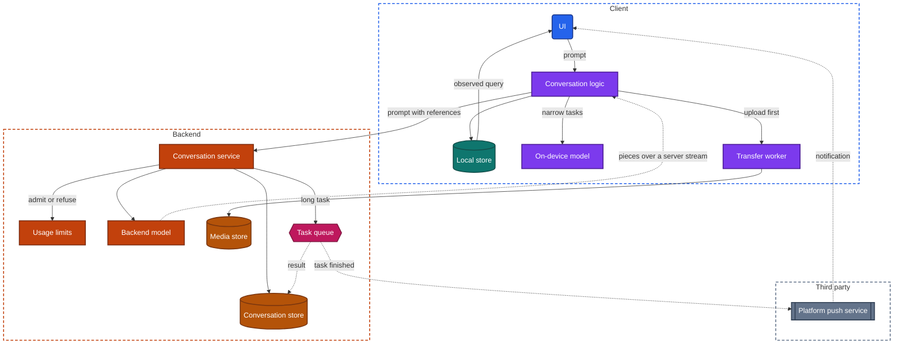
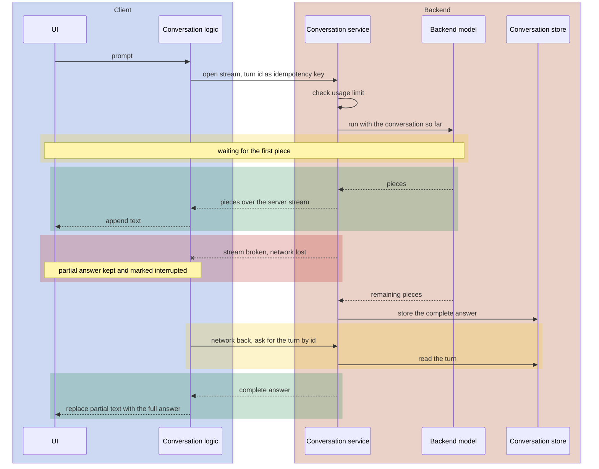

import Probe from '../../../components/Probe.astro';
import Signals from '../../../components/Signals.astro';
import TeardownBar from '../../../components/TeardownBar.astro';
import WorksheetForm from '../../../components/WorksheetForm.astro';

> **The archetype.** An app, or a feature inside an app, in which a person writes or speaks a request in ordinary language and a model produces the answer as text, speech, an image or a completed task.

## 50.1 What defines this archetype

An assistant makes one promise. Ask in your own words, and get a useful answer that starts appearing at once.

- **In your own words.** There is no form and no fixed set of commands. The input is free text, speech, a photo or a file, and the conversation so far is part of every request.
- **A useful answer.** Usefulness comes from a model, and the model is the most expensive component in the system. Each answer costs compute in a way that a database read does not.
- **Starts appearing at once.** A full answer takes many seconds to produce. The product is only tolerable if the first words arrive in about a second and the rest follows as it is made.

The third clause shapes the client most. In most apps a request is waiting or done. Here a request has a long middle, during which the response is partly on screen, still growing, and exposed to everything a phone does to a connection.

Four concerns dominate the design.

| Concern | Why it dominates | Chapter |
|---|---|---|
| Real-time delivery | The answer is a server stream, and the stream can break | [Chapter 14](/part-2-concerns/14-real-time-delivery/) |
| On-device intelligence | Where the model runs decides cost, privacy, speed and offline behavior | [Chapter 29](/part-2-concerns/29-personalization-and-on-device-intelligence/) |
| Offline and sync | A conversation is data that must be on every device of the account | [Chapter 12](/part-2-concerns/12-offline-and-sync/) |
| Background work and notifications | Answers and tasks outlast the time the app is on screen | [Chapter 23](/part-2-concerns/23-background-work-and-notifications/) |

[Chapter 18](/part-2-concerns/18-file-transfer-uploads-and-downloads/) supplies the mechanism for attachments, and [Chapter 21](/part-2-concerns/21-security-and-trust/) the rule that the backend decides usage limits.

The archetype has three variants.

| Variant | Where the model runs | What is distinctive |
|---|---|---|
| Chat assistant on a large backend model | Backend | The conversation is the product. History, attachments, voice mode and long tasks all appear |
| Assistant feature inside another app | Backend, called by that app's own services | Narrow tasks on the app's own data. Often no history and no stop control |
| On-device assistant | Device | Works in airplane mode. Smaller model, narrower tasks, a large download |

A product can mix them. Section 50.6 gives the probes that separate them.

## 50.2 Requirements read from the product

None of these requirements names a design.

**What the app does**

- Accept a prompt as text, and in many products as speech, a photo or a file.
- Show the answer while it is being produced.
- Let the user stop an answer, and ask for another version of it.
- Keep each conversation, list past conversations, and show them on every device of the account.
- Hold a spoken conversation in which the user can interrupt.
- Run a task that takes minutes, and tell the user when it is done.
- Offer controls over what is kept and what conversations are used for.

**Qualities it must have**

- The first words appear within about a second or two. A blank wait of ten seconds reads as broken.
- Text that is on screen stays on screen. A dropped connection does not erase what the user was reading.
- A prompt is answered once. A retry does not create two answers or count twice against a limit.
- The screen stays smooth while text arrives, although its content changes many times per second.
- The user can read back while new text arrives, without being pulled to the bottom.
- Nothing the user said is used in a way they did not agree to.

Of the seven constraints of [Chapter 2](/part-1-method/2-the-mobile-constraint-set/), three bind hardest. Unreliable network and process death both threaten a response that takes thirty seconds to arrive. Untrusted client governs usage limits, since each request costs the maker real money.

## 50.3 Running the probes

Run the general probes first, then the eight probes of this chapter. [Chapter 4](/part-1-method/4-probes/) describes the probe families and how to run a probe cleanly. Use prompts with nothing private in them.

### Probes from Chapters 29 and 14

Start with [Chapter 29](/part-2-concerns/29-personalization-and-on-device-intelligence/), because the placement of the model decides how to read everything else.

| Probe | Typical outcome for a chat assistant | What it tells you |
|---|---|---|
| P29.6 Assistant response shape | Text appears progressively and stalls unevenly on a weak connection | A real stream from a backend model, not an animation |
| P29.1 Smart feature in airplane mode | It fails or is disabled | No on-device model for the main task |
| P29.3 Storage after enabling a feature | No real growth, and the feature needs the network | The model stays on the backend |
| P29.8 Second device | Conversations and learned facts follow the account | A backend profile |

For the on-device variant, P29.1 gives "works as well as online", and P29.3 and P29.9 show a download of a model asset.

From [Chapter 14](/part-2-concerns/14-real-time-delivery/), run P14.4 and P14.9 with a second device of your own. P14.9 asks whether an action on one device appears on the other at once. Typical for a chat assistant is that it appears only after a refresh, because a server stream serves one request and is not a subscription to the account. P50.5 is the archetype's form of that probe.

### Probes from Chapters 12, 18, 21 and 23

From [Chapter 12](/part-2-concerns/12-offline-and-sync/), run P12.1 on the conversation list and P12.2 on the prompt field. Typical is that visited conversations can be read offline and the send control is disabled or fails. That is Level 1.

From [Chapter 18](/part-2-concerns/18-file-transfer-uploads-and-downloads/), run P18.2 with a large attachment. Typical is a restart from zero, since attachments are small enough that few teams build resumable transfer for them.

From [Chapter 21](/part-2-concerns/21-security-and-trust/), run P21.1 and P21.6. Typical is that every action is refused offline, and that signing out removes the conversations from the device.

From [Chapter 23](/part-2-concerns/23-background-work-and-notifications/), run P23.1 to read the notification categories, and P23.2 during voice mode. Typical for voice mode is that it continues in the background with an indicator shown by the system.

### Assistant probes

P50.1 to P50.3 examine one response under stress. P50.4 locates the model. P50.5 and P50.6 examine how conversations are stored. P50.7 covers attachments and P50.8 the limits.

<TeardownBar />

### P50.1 Stop mid-answer

<Probe id="P50.1" />

### P50.2 Leave mid-answer

<Probe id="P50.2" />

### P50.3 Network drop mid-answer

<Probe id="P50.3" />

### P50.4 Airplane-mode test

<Probe id="P50.4" />

### P50.5 History on a second device

<Probe id="P50.5" />

### P50.6 Regenerate

<Probe id="P50.6" />

### P50.7 Attachment order

<Probe id="P50.7" />

### P50.8 Read the usage limits

<Probe id="P50.8" />

## 50.4 The design, concern by concern

Each subsection states the design this archetype usually takes and the reason. The components are those of the universal app model in [Chapter 3](/part-1-method/3-the-universal-app-model/).

### The response as a server stream

A backend model produces an answer one small piece at a time. The backend forwards each piece over a server stream, and the client appends it. [Chapter 29](/part-2-concerns/29-personalization-and-on-device-intelligence/) introduces this shape, and [Chapter 14](/part-2-concerns/14-real-time-delivery/) explains why a server stream fits: data flows one way, for the length of one request.

Two delays matter, and they have different causes. The time to the first piece reflects queueing and model startup on the backend. The rate of pieces afterwards reflects the model's speed. Time them separately.

The stream usually carries typed events and not only text. A status such as "searching" before the first words, a list of sources, an image that appears inside the answer, and a final event that closes the turn are all events on the same stream. A status line that changes before any text arrives is the visible evidence.

The client side is a small pipeline.

```text
function sendPrompt(conversation, text):
  turn = Turn(id: newUniqueId(), conversation, text)
  localStore.insert(turn)                     // the prompt shows at once
  answer = localStore.insert(Answer(turn: turn.id, state: Streaming))
  stream = backend.openStream(turn)           // turn id is the idempotency key
  for event in stream:
    answer.apply(event)                       // text, status or attachment
  match stream.end:
    Complete:      answer.state = Done
    Stopped:       answer.state = StoppedByUser    // partial text is kept
    Dropped:       answer.state = Interrupted      // ask the backend for the turn later
    LimitReached:  answer.state = Refused          // carries the reset time
```

The prompt is an optimistic update. It appears in the conversation before the backend has accepted it. The answer is an item whose content grows, which is unusual: most data in an app arrives whole.

### Rendering text as it arrives

Drawing a growing answer is harder than it looks, and the quality of this work is visible to any user.

- **Batching to the frame.** Pieces can arrive faster than the screen redraws. The client collects them and updates once per frame, or it does layout work for text that nobody saw.
- **Incomplete markup.** The answer is usually formatted text. Half-way through, a code block has opened and not closed, and a table has two of its five rows. The renderer must draw a sensible partial state and not flicker between plain and formatted.
- **Scroll position.** While the user is at the bottom, the view follows the new text. Once the user scrolls up to read, the view stays put and a control offers to return to the latest text. An app that drags you down while you read has skipped this.
- **Layout cost.** Measuring a long answer again for every piece gets slower as the answer grows, so clients limit the work to the last block that changed.

Watch a long answer with a table and a block of code in it. Flicker, jumps and a view that fights your scrolling are each Observed facts about the client.

### Stopping and regenerating

Stopping is cancellation in the sense of [Chapter 13](/part-2-concerns/13-network-transport-and-resilience/). The client closes the stream, and the backend stops the model. Every piece costs compute, so the team wants a stop to reach the model and not just hide the text.

What remains after a stop is a design decision that P50.1 exposes. If the partial answer survives a restart of the app, somebody saved it. With a backend conversation store, the backend saves what it had produced when the cancel arrived. If the partial answer is on screen and gone after a restart, it lived only in screen state.

Regenerating asks the model to answer the same turn again. It exposes the shape of the conversation store.

| Behavior | Store shape | Consequence |
|---|---|---|
| Versions kept, with a control to switch | A tree. A turn can have several answers, and the visible conversation is one path | Editing an earlier prompt creates a branch in the same way |
| The new answer replaces the old | A list in which the last item is overwritten | Simple. The old answer is lost to the user |
| The new answer is appended | An append-only list | Regenerate is only a shortcut for sending again |

A tree is harder to sync and to page than a list. Its presence tells you that the team treats a conversation as a document with history, not as a log. P50.6 records the shape.

### A stream interrupted

A long response is exposed to two interruptions, and a good design treats both as normal.

**The app leaves the foreground.** The user asks a question and switches to another app. The operating system gives the app a short period and then suspends it, and the stream breaks. [Chapter 23](/part-2-concerns/23-background-work-and-notifications/) describes these limits.

**The network drops.** The device moves between networks, or enters an elevator. The stream breaks the same way.

The deciding question is who owns the response once it has started. There are three designs.

| Design | What the backend does when the client is gone | What the user sees on return |
|---|---|---|
| The stream is the only copy | Stops, or runs on and discards the result | A partial answer with a retry control. Retry runs the model again |
| The backend finishes and stores | Completes the answer and writes it to the conversation store | The complete answer, fetched when the conversation is reloaded |
| A resumable stream | Completes or continues, and keeps the events with sequence numbers | The stream rejoins from the last event the client holds, with no gap and no repeat |

The second design is the common one for a chat assistant, and it follows from keeping history on the backend. Once the backend stores conversations, running the answer to the end costs little more than abandoning it, and the user gets what they asked for. The third design is catch-up by cursor from [Chapter 14](/part-2-concerns/14-real-time-delivery/), applied inside a single answer.

P50.2 and P50.3 separate the three. Their readings differ in one respect. An answer that is complete after backgrounding could also come from an app that was allowed to keep working for a while. An answer that completes after airplane mode has only one explanation, because no client could have received it. Run both, and trust P50.3 more.

The client's duty is the same in every design. Text that reached the screen is written to the local store as it arrives, so that an interruption leaves the partial answer in place and marked as interrupted. Replacing visible text with an error is the failure mode to record.

The retry must be idempotent. The turn has a client-generated id. If the client resends a prompt whose first attempt reached the backend, the backend returns the answer it has or rejoins the one in progress. Without that, an interruption produces two answers and two charges against the usage limit.

### Conversation history as synced data

A conversation that appears on a second device is stored on the backend. The model holds no memory between requests. Either the backend loads the earlier turns from its store, or the client sends them with every prompt. With a backend store, the client sends only the new turn and a conversation id.

In the terms of [Chapter 12](/part-2-concerns/12-offline-and-sync/), the typical chat assistant sits at Level 1. Conversations that the device has opened are readable offline from the local store. New prompts are refused offline. A prompt outbox, which would make it Level 2, is rare, and for a good reason. The user wants the answer now, and an answer that arrives twenty minutes later answers a question they have stopped asking. P50.4 has an outcome for the exception.

Sync between devices is usually simple. A conversation is written by one device at a time and appended to, so conflicts are rare. Most products fetch the conversation list when it is opened and do not push changes to other devices. P50.5 shows whether a new conversation appears on a second device by itself. Where it does, a persistent connection or a push hint carries change events for the account.

Three small behaviors are informative.

- **Titles.** A conversation gets a title a moment after the first answer. That is a second, cheaper model call on the backend, and the title arrives as a later event or on the next fetch.
- **Deleting.** Deleting a conversation on one device removes it from the others on their next fetch. A tombstone on the backend carries the deletion.
- **Memory across conversations.** If the assistant recalls a fact from a different conversation, the backend keeps a backend profile per account and adds it to the model inputs. That should have a visible control.

### Attachments

Files reach the model by upload, then attach, the pattern of [Chapter 18](/part-2-concerns/18-file-transfer-uploads-and-downloads/). The client sends the file to media delivery when the user picks it and receives a reference. The prompt carries the reference.

The reasons are stronger here than in messaging. The prompt request must open a stream quickly, and it cannot do that with twenty megabytes in its body. The backend also has work to do on the file before the model can read it: extracting text, reducing an image, checking the type. Starting that work at pick time hides it behind the seconds the user spends typing.

P50.7 shows the order. Upload progress on the attachment before you tap send, and a send control that waits for it, are the signature. A file that moves only after the tap, followed by a long wait before the first words, is the single-request design.

### Voice mode as a live audio path

A spoken conversation can be built in two ways, and they feel different.

**A chain of requests.** The client records until you stop speaking, uploads the recording, the backend turns it into text, runs the model, turns the answer into speech and returns audio. Each step waits for the one before. The delay is seconds, and you cannot interrupt.

**A live audio path.** The client opens a two-way audio connection for the whole conversation, as in a call. Audio flows continuously in both directions. The backend decides when you have finished speaking, begins to answer within a fraction of a second, and stops speaking when you start. This is the media path of [Chapter 19](/part-2-concerns/19-live-calls-and-live-streaming/), with a model at the far end in place of a person.

Three observations separate them. Speak over the assistant while it is talking: only a live audio path stops mid-sentence. Note the delay between the end of your sentence and the start of the answer. Lock the screen during voice mode: a live audio path continues as user-visible work with the system's microphone indicator, and a chain of requests usually stops.

Voice mode also needs the microphone permission, asked in context when you first tap the control. [Chapter 22](/part-2-concerns/22-privacy-permissions-and-consent/) covers the refusal path. The spoken turns normally appear afterwards as text in the conversation, which shows that both modes write to the same store.

### Long-running tasks

Some requests take minutes: research across many sources, a long document, a generated image or video. No stream survives that long on a phone, and nobody watches a progress indicator for five minutes.

The design changes from a stream to a job. The backend accepts the task, returns at once with a task record, and runs it on a queue. The client shows the task's state, and may leave. When the task finishes, the backend writes the result to the conversation and sends a platform push. The notification is the announcement, and tapping it opens the conversation by a deep link.

```text
function onTaskAccepted(task):
  localStore.insert(task)                // state: Running, with a stated estimate
  if not notificationsAllowed():
    showExplanationScreen()              // the result has no other way to announce itself

function onOpenConversation(conversation):
  for task in runningTasks(conversation):
    refresh(task)                        // the backend is the source of truth, not the push
```

The push is a hint and the conversation store is the truth. A client that relied on the push alone would lose results whenever notifications are off. While the app is open, progress arrives by polling the task or by a stream of status events. From outside the two look alike unless the progress text changes on a steady beat.

Run P14.4 with a long task in place of a second account. Start the task, leave the app, and note whether a notification arrives and whether the result is already present when you tap it.

### Usage limits and quotas

Each answer costs the maker compute, so every product limits use. The limit is counted per account on the backend, in the same service that admits the request. [Chapter 21](/part-2-concerns/21-security-and-trust/) gives the reason: a client check is only for display, and a count kept on the device could be reset by reinstalling.

Three details are visible.

- **Where the figure comes from.** A counter or a reset time in the app is backend data that the client displays. It disappears or goes stale in airplane mode.
- **What the refusal looks like.** At the limit, the backend refuses the request with a structured reason, and the client shows a message with the reset time and often an offer to upgrade. The plan is an entitlement in the sense of [Chapter 26](/part-2-concerns/26-payments-and-subscriptions/).
- **What is limited.** Limits are often per capability. A stronger model, image generation, voice minutes and long tasks each have their own quota, and at a limit the product may fall back to a weaker model instead of refusing.

Do not look for the limit by sending prompts until one is refused. P50.8 reads what the maker states. If you reach a limit in normal use, record the wording and whether the count agrees across your devices.

### On-device model against backend model

[Chapter 29](/part-2-concerns/29-personalization-and-on-device-intelligence/) sets out the trade. A backend model is large and current, costs the maker money per answer, and sees the user's text. An on-device model is small, costs the user battery and storage, works with no network, and keeps the text on the device.

P50.4 is the airplane-mode test, and it is the most informative single probe in the chapter. Its four outcomes map to four designs: backend only, a split in which the device handles narrow tasks, device only, and a queued prompt.

Three passive observations support it.

- **Storage.** An on-device model is a model asset of hundreds of megabytes or more. It arrives in the app package, with the operating system, or as a download on first use. P29.3 and P29.9 show which.
- **Device class.** A feature offered only on recent devices, stated in the store listing or the help pages, points to an on-device model that older hardware cannot run.
- **Speed.** An on-device answer starts with no network delay and proceeds at a rate set by the device. Its speed does not change with the connection. P29.2 measures this.

A split design routes each request. Simple rewriting and summarizing of short text stay on the device, and everything else goes to the backend. From outside you see the rule only through what works in airplane mode. How the client decides is Speculative.

### Consent for the use of conversations

People tell an assistant things they tell nobody else. [Chapter 22](/part-2-concerns/22-privacy-permissions-and-consent/) covers consent, and this archetype has its own set of controls. Read the settings and record which exist.

| Control | What it implies on the backend |
|---|---|
| A switch for using conversations to improve the service | A consent record per account, read before any conversation is used for training |
| A temporary conversation that is not kept | A path that skips the conversation store, or stores with a short retention |
| A history switch | Conversations stored or not, per account |
| Delete one conversation, or all | Deletion that reaches every device, and a stated delay before backend copies are removed |
| A view of what the assistant remembers about you | A backend profile with an editing interface |
| Export of conversations | A job that assembles the account's data |

You cannot observe what the backend does with a conversation. You can observe that the controls exist, where the choice is stored, and whether it follows the account. Change the training switch on one device and read it on another. If it follows, the consent record is on the backend. Any claim about what happens to the data after that rests on the maker's published policy, and you record it as what the maker states.

An assistant feature inside another app raises one more question: whether the content you select leaves that app's backend for a third party's model. The app's privacy listing and help pages are the only source.

## 50.5 End-to-end architecture

Figure 50.1 shows the components that the probes imply for a chat assistant with a small on-device model for narrow tasks.



*Figure 50.1. The client and backend of a chat assistant. The stream runs from the backend model to the conversation logic, and long tasks leave by the task queue.*

In the terms of the universal app model, the conversation store is the backend store, the task queue is async delivery and the media store sits behind media delivery. There is no sync engine in the usual sense. The on-device variant removes most of the backend zone and keeps the conversation in the local store. An assistant feature inside another app keeps the stream and drops the conversation store, the task queue and often the local store.

Figure 50.2 follows one response that loses its network half-way, in the design where the backend finishes and stores.



*Figure 50.2. A streamed response that loses its network. The backend finishes without the client, and the client recovers the answer by the id of the turn.*

In the design where the stream is the only copy, the two lines after the failure phase are absent, and the reconnect sends the prompt again. That costs a second run of the model.

## 50.6 Variants and how to tell them apart

Two questions separate the variants. [Chapter 5](/part-1-method/5-from-signal-to-inference/) describes how a signal becomes a claim with a confidence word.

| Question | Discriminating probe | Reading |
|---|---|---|
| Where does the model run | P50.4, confirmed by P29.3 | Answers in airplane mode mean an on-device model. Refusal means a backend model |
| Is the conversation a stored object | P50.5, with P50.1 | History on a second device means a backend conversation store |
| Who owns a response in progress | P50.3, with P50.2 | Completion without the client means the backend finishes and stores |
| Is the conversation a tree or a list | P50.6 | Switchable versions mean a tree |
| Is voice a live audio path | Interrupt the assistant while it speaks | Stopping mid-sentence means a live audio path |

**Chat assistant against assistant feature.** A feature inside another app is recognizable by what it lacks. It has no conversation list, often no stop control, and its result is inserted into the host app's own data: a draft, a summary on a document, a reply suggestion. The host app's backend calls the model, so limits and consent follow the host app's account. P50.1, P50.5 and P50.6 mostly return "not offered", and that is the finding.

**Backend model against on-device model.** P50.4 separates them. The honest limit is the split design. An app that answers offline may still send the same request to the backend when a network is present, and from outside the only evidence is a difference in quality or speed between the two conditions. Record such a difference as Observed and the routing rule as Speculative.

**What cannot be told apart.** Who runs a backend model, which model answers, and whether simple prompts go to a cheaper one cannot be probed. Record only what the maker states.

<Signals chapter={50} />

## 50.7 What changes with scale

The client is nearly the same at every size. A stream reader, a renderer for growing text, a local store of conversations and a retry by turn id are needed for ten users and for ten million.

**What changes**

- **Capacity.** Model compute is scarce in a way that ordinary services are not. At small size, every request goes straight to the model. At large size, requests are queued, and the time to the first piece varies with the hour. A wait that is longer at busy times is a Speculative signal of queueing.
- **Limits.** A small product has one limit per account. A large one has a quota per capability and per plan, falls back to weaker models at peak, and adjusts all of this by remote config.
- **Who owns the response.** A small product often lets the stream be the only copy. A large one finishes and stores, because retries that run the model again are the most expensive failure it has.
- **On-device work.** At very large scale, moving narrow tasks to an on-device model removes backend cost. The split design is partly an economic decision.
- **Safety systems.** Checks on prompts and answers run beside the model. From outside you see an answer that is withdrawn or replaced after it began to appear, which shows that a check ran on the stream and not only before it.

## 50.8 Completed worksheet

[Chapter 6](/part-1-method/6-the-teardown-worksheet/) describes the worksheet and the order in which to fill it in. The fields in this form are specific to the archetype. The probes of Section 50.3 fill most of them.

<TeardownBar />

<WorksheetForm chapters={[50]} />

The fields that the Part II chapters add to the worksheet take these typical values for a chat assistant on a backend model. A value that differs in your teardown is a finding.

| Field | Typical value for the archetype | Confidence |
|---|---|---|
| Assistant response, [Chapter 29](/part-2-concerns/29-personalization-and-on-device-intelligence/) | Streamed from the backend | Inferred |
| Model placement, [Chapter 29](/part-2-concerns/29-personalization-and-on-device-intelligence/) | Backend, or split for narrow tasks | Inferred |
| Offline level, [Chapter 12](/part-2-concerns/12-offline-and-sync/) | 1 Cached reads | Inferred |
| Offline write actions, [Chapter 12](/part-2-concerns/12-offline-and-sync/) | None. Prompts are refused | Observed |
| Foreground mechanism, [Chapter 14](/part-2-concerns/14-real-time-delivery/) | A server stream per request, and nothing between requests | Inferred |
| Multi-device, [Chapter 14](/part-2-concerns/14-real-time-delivery/) | Changes reach a second device on refresh | Observed |
| Attach order, [Chapter 18](/part-2-concerns/18-file-transfer-uploads-and-downloads/) | Upload, then attach | Inferred |
| Long-running work, [Chapter 23](/part-2-concerns/23-background-work-and-notifications/) | Voice mode continues with an indicator. Tasks run on the backend | Observed |
| Backend components implied | Conversation service, usage limits, backend model, conversation store, media delivery, a task queue as async delivery, platform push as a third party | Inferred |
| Failure modes seen | A partial answer replaced by an error, a retry that produces a second answer, a finished task with no notification | Observed |

## 50.9 As an interview question

The question is usually asked as "design the client for a chat assistant" or "add an assistant to this app". It tests whether you can design around a response that takes thirty seconds and arrives in pieces.

**Clarify first.** Ask four things.

1. Whether the model runs on the backend, on the device, or both.
2. Whether conversations are kept, and whether they appear on several devices.
3. Which inputs are in scope: text only, or attachments and voice.
4. Whether any request takes longer than a stream can reasonably stay open.

Then state the promise from Section 50.1. The clause "starts appearing at once" justifies the stream, and "a useful answer" justifies protecting the answer from interruption.

**Go deep on three concerns.**

- **The stream and its rendering.** A server stream of typed events, written to the local store as it arrives, drawn once per frame, with a scroll rule that respects a user who is reading. Say what stop does on both sides.
- **Interruption.** Who owns a response in progress. Compare the stream as the only copy, the backend that finishes and stores, and a resumable stream. Give the turn a client-generated id and make the retry idempotent. Draw Figure 50.2.
- **Where the model runs.** The trade between a backend model and an on-device model in cost, privacy, quality, storage and offline behavior, and how a split design routes.

**Trade-offs an interviewer expects to hear.**

- A server stream against polling for pieces, and why a persistent connection for the whole account is more than a single answer needs.
- Finishing on the backend against stopping when the client leaves: wasted compute against a lost answer.
- A conversation as a list against a tree, and what a tree costs in sync and paging.
- Upload at pick time against upload with the prompt.
- Refusing prompts offline against queuing them.
- A stream against a job with a notification, and the duration at which you would switch.

Mention that usage limits are counted on the backend and that the client only displays them. Mention consent for the use of conversations before you are asked.

## 50.10 Summary

- An assistant promises a useful answer, in the user's own words, that starts appearing at once. The response is a server stream of typed events from a backend model, and the client renders it as it grows.
- Stop is cancellation that reaches the model. Regenerate reveals whether a conversation is stored as a list or a tree.
- A response in progress can lose its client. The stream may be the only copy, the backend may finish and store, or the stream may be resumable. The airplane mode step of P50.3 separates them.
- Conversations are synced data on the backend, usually read at Level 1 and fetched on demand. Prompts are rarely queued.
- Attachments go by upload, then attach. Voice mode in its strong form is a live audio path that the user can interrupt.
- A long-running task is a backend job. Its result is written to the conversation and announced by notification, and the push is only a hint.
- Usage limits are counted per account on the backend. The client displays the figure and never decides.
- The airplane-mode test, P50.4, locates the model. Consent controls for conversations can be observed. What the backend does with a conversation cannot.
