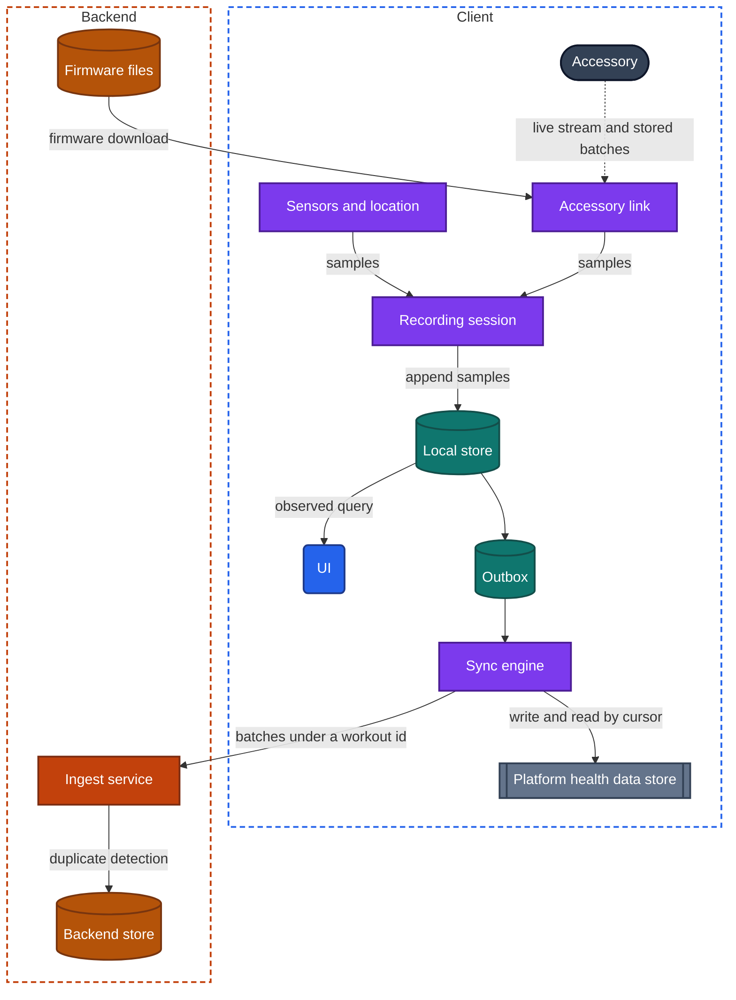
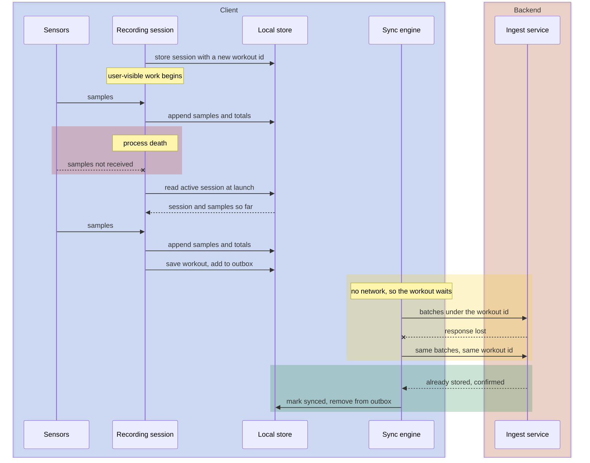

import Probe from '../../../components/Probe.astro';
import Signals from '../../../components/Signals.astro';
import TeardownBar from '../../../components/TeardownBar.astro';
import WorksheetForm from '../../../components/WorksheetForm.astro';

> **The archetype.** An app that records measurements of the body and of activity, from the phone's own sensors, from a wearable or other accessory, or from the platform's shared health data, and shows them as workouts, trends and goals.

## 51.1 What defines this archetype

A health or fitness app makes one promise. Everything your body and your devices measure is recorded, even with the phone in a pocket and no network.

Each clause costs something.

- **Everything.** A recording has no gaps. A measurement that was taken and then dropped cannot be taken again.
- **Your devices.** The data comes from several sources: the phone, a watch, a chest strap, a scale, other apps. Each has its own clock, its own storage and its own idea of the same hour.
- **In a pocket.** The screen is off and the app is in the background for nearly all of a recording. The operating system decides whether the app may keep running.
- **No network.** A run in the hills or a swim has no connection. The recording cannot depend on the backend at any step.

One clause is unwritten. The data is about a body, so it is sensitive, and the platform and the law both treat it that way.

Four concerns dominate.

| Concern | Why it dominates | Chapter |
|---|---|---|
| Location, sensors and hardware | The app's input is hardware, and each source has a battery cost | [Chapter 24](/part-2-concerns/24-location-sensors-and-hardware/) |
| Background work | A recording is long-running work with the screen off | [Chapter 23](/part-2-concerns/23-background-work-and-notifications/) |
| Offline and sync | Samples are created on the device and reach the backend later, from more than one source | [Chapter 12](/part-2-concerns/12-offline-and-sync/) |
| Platform surfaces | A watch, a lock-screen view and the platform's health data are all outside the app's window | [Chapter 25](/part-2-concerns/25-platform-surfaces-widgets-wearables-and-extensions/) |

[Chapter 22](/part-2-concerns/22-privacy-permissions-and-consent/) and [Chapter 35](/part-2-concerns/35-performance-and-resource-budgets/) follow closely, for consent and for battery.

The archetype has three variants. They differ in where a measurement is first stored.

| Variant | Where a measurement is first stored | What the phone app is |
|---|---|---|
| Phone-only tracker | The app's local store, from the phone's sensors | The recorder |
| App paired with an accessory | The accessory's own storage | A relay, a display and a remote control |
| Platform health data store client | A shared repository that the operating system keeps on the device | One reader and writer among several |

Most products combine them. Record each variant the product uses.

## 51.2 Requirements read from the product

These are requirements as a user experiences them. None of them names a design.

**What the app does**

- Record a workout with time, distance, route, pace and heart rate, and show live figures while it runs.
- Count steps, sleep and other daily activity without being opened.
- Connect to a wearable or other accessory, and show what it measured.
- Show history, trends and progress toward goals.
- Show the same history on a new phone and on other devices, where the product has accounts.
- Exchange data with other health apps on the same device.
- Update the software of an accessory.

**Qualities it must have**

- A recording continues with the screen off, for hours.
- A recording survives a crash, a restart of the device and a dead battery, up to the moment it stopped.
- Recording works with no network from start to save.
- Data measured while the phone was absent arrives later, complete.
- One workout appears once, however many sources reported it.
- The battery cost is in proportion to what was recorded, and close to zero on a day with no workout.
- Health data is shown, shared and uploaded only with consent, and can be exported and deleted.

Of the seven constraints of [Chapter 2](/part-1-method/2-the-mobile-constraint-set/), three bind hardest. Process death and platform rules shape the recording, because the app must stay alive in the background and must survive when it does not. Limited resources shape the choice of sensors, because a continuous precise position is among the most expensive things a phone can do.

## 51.3 Running the probes

Run the general probes first. Most need a short walk outdoors. [Chapter 4](/part-1-method/4-probes/) describes the probe families and how to run a probe cleanly.

### Probes from Chapters 24 and 23

These come from [Chapter 24](/part-2-concerns/24-location-sensors-and-hardware/) and [Chapter 23](/part-2-concerns/23-background-work-and-notifications/). Run them on a workout recording.

| Probe | Typical outcome for this archetype | What it tells you |
|---|---|---|
| P24.1 Location indicator on screen | On during a workout, off on every other screen | The subscription belongs to the recording session |
| P24.2 Location indicator in the background | On continuously, with a persistent marker or notification | Continuous background location, as user-visible work |
| P24.5 Move in the background | A complete route that follows every turn | Readings were not reduced in the background |
| P24.6 Record offline | The whole route is present on the other device | Readings are buffered in the local store and uploaded later |
| P24.7 Battery after a session | A large share, much of it in the background | The cost of continuous precise location |
| P24.10 Hardware unavailable | The app explains what is off and recovers | The accessory link has an explained failure state |
| P23.2 User-visible work | The recording continues, with an indicator shown by the system | The recording holds a lasting background grant |
| P23.7 Low-power mode | The recording continues. Background sync of daily data is later | Deferred tasks are held back, and the recording is not |

### Probes from Chapter 12

Run these from [Chapter 12](/part-2-concerns/12-offline-and-sync/) on the workout history.

| Probe | Typical outcome | What it tells you |
|---|---|---|
| P12.1 Offline read | All past workouts appear, including ones never opened on this device | A local replica of the user's history |
| P12.2 Offline write | A workout can be recorded, saved, renamed and deleted | Level 3 for the user's own records |
| P12.3 Kill while pending | The saved workout is still there | Durable outbox |
| P12.4 Reconnect | It sends from any screen, often in the background | App-level sync engine |
| P12.11 Flaky network duplicates | No duplicate workout | Client-generated id for each workout |

The conflict probes, P12.5 to P12.8, mostly do not apply. A sample is written once and never edited. Two devices that record at the same time have not changed the same data. They have each added data, and the matter to settle is duplicates, which P51.6 tests. Conflicts exist only on small fields such as a workout's name or a daily goal, where LWW is typical.

### Probes from Chapters 25, 22 and 35

- **P25.5 Live status after a force-quit**, from [Chapter 25](/part-2-concerns/25-platform-surfaces-widgets-wearables-and-extensions/). Typical is a lock-screen view that follows the workout and freezes or disappears when the app is force-quit, because the app itself feeds it.
- **P25.7 Watch with the phone off and P25.8 Watch write with the phone off.** Typical for a fitness product is a watch that works, and a write that arrives after the phone is back. P51.5 repeats these on a whole workout.
- **P22.1 First-run prompts and P22.2 Deny on first request**, from [Chapter 22](/part-2-concerns/22-privacy-permissions-and-consent/). Typical is a prompt for each permission at the feature that needs it, and a workout that can still be timed without a route when location is refused.
- **P22.4 Grant, then revoke.** P51.7 runs it on health access.
- **P22.8 Account deletion path, P22.9 Data export path and P22.10 Store listing against behavior.** Typical is an export of your records as a file, and a privacy listing that declares health and fitness data and precise location.
- **P35.3 Battery over a day**, from [Chapter 35](/part-2-concerns/35-performance-and-resource-budgets/). Run it once on a workout day and once on a rest day. Typical is notable background use on the first, explained by the recording, and very little on the second.

### Probes for this archetype

These eight probes are specific to the archetype. P51.4 and P51.8 need an accessory, and P51.5 needs a watch app. Skip those that do not apply, and record that on the worksheet.

<TeardownBar />

### P51.1 Kill mid-workout

<Probe id="P51.1" />

### P51.2 Offline workout, end to end

<Probe id="P51.2" />

### P51.3 History from before the install

<Probe id="P51.3" />

### P51.4 Accessory away from the phone

<Probe id="P51.4" />

### P51.5 Workout on the watch alone

<Probe id="P51.5" />

### P51.6 One workout, two sources

<Probe id="P51.6" />

### P51.7 Revoke health access

<Probe id="P51.7" />

### P51.8 Leave during a firmware update

<Probe id="P51.8" />

## 51.4 The design, concern by concern

Each subsection states the design this archetype usually takes and the reason. The components are those of the universal app model in [Chapter 3](/part-1-method/3-the-universal-app-model/).

### A recording is user-visible work

A workout lasts from minutes to hours, with the screen off. An app in the background is suspended within moments unless it holds a grant. The grant that fits is user-visible work, as [Chapter 23](/part-2-concerns/23-background-work-and-notifications/) describes: the app declares an ongoing activity, and the platform shows a persistent indicator for as long as it runs.

The recording session is a component of its own, apart from any screen. It starts the sensors, receives samples, and stores them. The workout screen is an observed query on what the session has stored. Leaving the screen, or losing it to a configuration change, does not touch the recording.

The grant lowers the chance of process death and does not remove it. The session therefore writes its own state to the local store when it starts and whenever it changes.

```text
function onLaunch():
  session = localStore.activeSession()      // written at start, cleared at save or discard
  if session exists:
    gap = now() - session.lastSampleTime
    if gap is short: resumeRecording(session)        // restart sensors, keep appending
    else: offerResumeOrFinish(session, endedAt: session.lastSampleTime)
```

P51.1 tests this. An app that resumes, or offers to, has stored the session. An app that shows a partial workout has stored the samples and not the session. An app that shows nothing kept both in memory.

The lock-screen view of a running workout is a live status, fed from the same session, so it stops when the process does.

### Samples go to the local store as they arrive

A sample is one measurement with the time the sensor recorded it: a position, a heart rate, a step count for an interval. The rule of the archetype is that a sample is durable before the next one arrives.

```text
function onSamples(session, batch):
  kept = batch.filter(s => s.accuracy is acceptable)
  transaction(localStore):
    appendSamples(session.id, kept)          // append only, never rewritten
    session.lastSampleTime = kept.last().time
    session.totals = updateTotals(session.totals, kept)
```

Three choices in this block matter.

- **Append only.** A sample is never edited, so the write is cheap and the data has no conflicts.
- **Small batches.** Writing every sample in its own transaction wastes battery. Writing every few seconds bounds the loss from a crash to those seconds.
- **Running totals stored with the samples.** Distance and duration are kept up to date in the same transaction, so the screen and the lock-screen view read one small record and do not recompute from thousands of samples.

Durations come from the device's steady clock, not from the wall clock. A corrected clock or a new time zone during a workout must not create a jump in the record.

### Sensors, location and their battery cost

Each source has a cost, and the design subscribes to it only while a feature needs it. [Chapter 24](/part-2-concerns/24-location-sensors-and-hardware/) covers the modes.

| Source | Cost | Used for | When it runs |
|---|---|---|---|
| Step and movement history from platform services | Close to zero | Daily steps, automatic detection of activity | Always, by the operating system |
| Raw motion sensors | Medium | Cadence, strokes, repetitions | During a recording |
| Continuous precise location | Highest | Route, distance, pace | During an outdoor recording |
| Accessory over a short-range radio | Low | Heart rate, power, weight | While connected |
| Barometer | Low | Climb | During a recording |

Two consequences are visible. First, the app has two regimes. All-day tracking reads what the operating system already counted, and costs almost nothing. A workout turns on the expensive sources for its duration. P35.3 on a workout day and on a rest day shows both regimes. Second, the app reduces cost inside a recording where it can. It lowers the location rate when you stand still, pauses automatically, and skips location for an indoor workout. A route with long straight segments, in P24.5, means that the reduction went further than the activity allowed.

P51.3 settles where daily steps come from. History from before the install can only come from the platform.

### Pairing an accessory and syncing its stored data

An accessory is a small computer with sensors, a little storage, a battery and a short-range radio. Most have no network connection. The phone is their relay, as [Chapter 24](/part-2-concerns/24-location-sensors-and-hardware/) notes.

**Pairing** happens once. The app discovers the accessory, the user confirms it, and the two exchange keys so that later connections are automatic and private. The backend usually records which account owns which accessory. That record is what lets a new phone find your accessory, and what stops another account from claiming it.

After pairing, data moves in two ways.

- **A live stream.** While connected, the accessory sends current values, such as heart rate every second. The stream is an input to a recording session, like a sensor on the phone. Nothing is retried. A value missed while out of range is gone from the stream.
- **Stored batches.** The accessory writes what it measures to its own storage, with a sequence number per record. When it reconnects, the app asks for everything after the last sequence number it holds, commits each batch to the local store, and only then tells the accessory that the batch may be discarded.

```text
function syncAccessory(accessory):
  loop:
    batch = accessory.recordsAfter(cursor[accessory.id])
    if batch is empty: return
    transaction(localStore):
      appendSamples(batch.records, source: accessory.id)
      cursor[accessory.id] = batch.lastSequence
    accessory.acknowledge(batch.lastSequence)      // only after the commit
```

This is the read path of [Chapter 12](/part-2-concerns/12-offline-and-sync/), with the accessory in the place of the backend. The accessory is the source of truth for what it measured, the phone holds a cursor into it, and the acknowledgment after the commit means that a dropped link repeats a batch and never loses one. A repeated batch is discarded by sequence number.

The accessory's clock needs care. It drifts, and it resets when the battery dies. The app sets it at each connection and converts record times from the accessory's clock to real time.

What triggers the sync is a choice that P51.4 exposes. The simplest design syncs when the app is opened. The fuller design asks the operating system to wake the app when the accessory comes into range, pulls the batches during that short wake, and hands the upload to a deferred task. The accessory's storage is finite, so a long absence ends in one of two ways: the oldest detail is overwritten, or detail is reduced to totals.

### The watch app: alone or dependent

A watch is the one accessory that runs the app's own code. [Chapter 25](/part-2-concerns/25-platform-surfaces-widgets-wearables-and-extensions/) gives three levels for a watch app, and a fitness product pushes toward the highest, because the watch is on the wrist during a workout and the phone often is not.

| Level | Recording a workout | Where samples are first stored |
|---|---|---|
| Remote control | The phone records. The watch shows figures and buttons | The phone |
| Records alone, syncs through the phone | The watch records with its own sensors | The watch's local store, then the phone |
| Works alone | The watch records and uploads over its own network | The watch's local store, then the backend |

A watch that records alone is a second instance of the whole client design: a recording session, a local store, an outbox and a workout id that it generates itself. The phone and the backend receive a finished workout from it, in the same way that they receive one from the phone.

P51.5 separates the levels. The platform detail from [Chapter 25](/part-2-concerns/25-platform-surfaces-widgets-wearables-and-extensions/) applies: with the phone near, the operating system may route the watch's traffic through it, so the only clean test is with the phone switched off.

### Upload is a sync problem with duplicate detection

A finished workout is a mutation in an outbox. Nobody waits for it, so the upload runs later, in a deferred task, on whatever network appears. [Chapter 12](/part-2-concerns/12-offline-and-sync/) covers the write path. Three points are specific to this archetype.

**The workout has a client-generated id.** It is created when the recording starts. It is the idempotency key for the upload, so a retry after a lost response creates nothing new.

**Samples travel in batches or as a file.** A long workout holds tens of thousands of samples. The client sends them in numbered batches under the workout id, or as one compressed file by resumable transfer. The backend accepts a batch it already holds without storing it twice.

**The same activity arrives from more than one source.** An idempotency key removes a repeat of one upload. It does not help when a phone and a watch each recorded the same run, or when the app reads back from the platform health data store a workout that it wrote there. These records have different ids and describe one event.

```text
function ingest(record):
  if store.hasId(record.id): return Existing          // a retry of the same upload
  if record.originId is ours: return Existing         // our own write, read back through the platform
  overlap = store.find(user, record.type, overlapping: record.timeRange)
  if overlap exists:
    return resolveBySourcePriority(overlap, record)   // keep one, or merge and keep both sources
  store.insert(record)
```

Duplicate detection therefore has three layers: by id, by origin and by overlap in time. The third is a rule, and rules differ. Some products prefer the source worn on the body. Some keep both and count one in the totals. P51.6 shows the result, and doubled totals show that a layer is missing.

Since samples are never edited, the read path on other devices is simple. A new device pulls summaries first, and loads the samples of a workout when it is opened.

### The platform health data store

Many platforms keep a repository of health data on the device that several apps read and write with the user's consent. This chapter calls it the platform health data store. It is a platform service, and the app's team does not run it.

It has properties that no other platform service shares.

- **Permission per data type and per direction.** The user grants reading of steps apart from reading of heart rate, and reading apart from writing. The system draws the screen.
- **Refusal can be hidden.** On some platforms an app cannot tell "reading refused" from "no data exists". The app must work with an empty answer and cannot always explain it. P51.7 shows how the app copes.
- **Every record has a source.** The store keeps which app or device wrote each record. An app can delete only what it wrote.
- **It is a replica that other writers change.** Records appear and disappear without the app acting. The app reads by a cursor that the platform provides, receives additions and deletions since that cursor, and can ask to be woken when new data arrives.

An app can use the store in three ways. It can write its workouts there, so that other apps see them. It can read from it, to show data from sources it has no direct link to. Or it can use the store as its only persistence, with no backend at all. The last is a legitimate design with a visible limit: the data follows the device's own backup, not an account, and a different platform starts empty.

Reading and writing together create a loop. The app writes a workout, the store reports a new workout, and the app imports it. The origin check in the `ingest` function breaks the loop.

Copying data from the store to the app's backend is a separate decision. The user allowed the app to read. That is not the same as allowing an upload, and the privacy listing treats the two apart.

### Privacy and consent for sensitive data

[Chapter 22](/part-2-concerns/22-privacy-permissions-and-consent/) covers permissions and consent. This archetype holds more of both than most.

- **Several permissions, asked in context.** Motion, location, the short-range radio, notifications and health data are separate grants. A careful app asks for each at the feature that needs it, with an explanation screen first, and has a degraded mode for each refusal: a workout without a route, a manual entry without an accessory.
- **Background location is its own step.** Recording a route with the screen off needs more than the permission for use on screen.
- **A consent record for health data.** In many regions, processing health data needs explicit consent, separate from the terms of service. Expect a dedicated screen, a stored choice, and a way to withdraw it.
- **Sharing is off by default.** A route shows where a person lives. Products that share workouts commonly hide the start and the end of a route.
- **Export and deletion.** The user can obtain their records as a file and can delete them.

Storage on the device follows the sensitivity, and [Chapter 21](/part-2-concerns/21-security-and-trust/) covers encrypted storage. On some platforms the health data store cannot be read while the device is locked, so a background sync may find it closed and must retry later.

Whether the backend uses the data for anything beyond showing it back to you cannot be observed. The consent screens, the privacy listing and the settings are claims. Record them as Observed claims, and record nothing about what happens behind them.

### Accessory firmware updates as a file transfer

A firmware update moves a file of some megabytes to the accessory over a link that carries a few kilobytes per second. It takes minutes. It is the file transfer of [Chapter 18](/part-2-concerns/18-file-transfer-uploads-and-downloads/) with a slow second leg.

1. The app asks the backend whether a newer version exists for this accessory model and its current version.
2. The app downloads the file to the device and checks it.
3. The app sends the file to the accessory in parts. The accessory records which parts it holds.
4. The accessory verifies the whole file, including its signature, and only then installs it and restarts.

Two properties are visible. Whether the transfer is resumable decides what a dropped link costs. Whether the app holds a background grant decides what happens when you leave the app. P51.8 tests both. Whether the accessory keeps its old software until the new one is verified cannot be probed safely, and you should not try.

## 51.5 End-to-end architecture

Figure 51.1 shows the components the probes imply for a product with a phone app, a paired accessory, the platform health data store and a backend.



*Figure 51.1. The client and backend of a fitness app with a paired accessory.*

The recording session is a background worker, and sensors, location and the accessory link are platform services. The platform health data store is drawn in the client zone with the shape of a third party, because it lives on the device and the app's team does not run it. A phone-only tracker with no accounts has no backend zone at all.

Figure 51.2 follows one workout that is recorded with no network, interrupted by process death, saved, and uploaded later.



*Figure 51.2. One workout from the first sample to a confirmed upload, across process death and a lost response.*

## 51.6 Variants and how to tell them apart

Each variant has a discriminating probe. [Chapter 5](/part-1-method/5-from-signal-to-inference/) describes how a result becomes a claim with a confidence word.

| Question | Discriminating probe | Reading |
|---|---|---|
| Where do daily steps come from | P51.3 | History before the install means the platform |
| Does the accessory store data or only stream it | P51.4 | A filled away period means stored batches |
| What wakes the accessory sync | P51.4 | Data on a second device before the app is opened means a wake by the operating system |
| Is the watch a second client | P51.5 | A workout recorded with the phone off |
| Is there a backend copy | P51.2, with a second device | A workout that appears elsewhere |
| Does the app use the platform health data store | The system permission screen, then P51.6 | The list of types to read and to write |

**Phone-only tracker.** No accessory screens exist. P51.1 and P51.2 carry the teardown.

**App paired with an accessory.** The app is of little use until an accessory is paired. Daily figures change when a sync completes, not while you watch. P51.4 separates an accessory that stores from one that only streams, and a sync in the background from a sync on open. An accessory with its own network connection is a different case: its data reaches the backend with the phone absent, and the app then pulls from the backend like any second device.

**Platform health data store client.** The app shows data from sources it never connected to. It often needs no account. P51.3 shows history from before the install, and a new phone restored from the device's backup has the data, while a different platform starts empty.

One limit applies. When the app both records and reads from the platform, a figure on screen may have come by either path. The source label on a record, where the product shows one, is the only direct evidence. Without it, a claim about the path of one figure is Speculative.

The signal table collects the behaviors from the eight probes and from normal use.

<Signals chapter={51} />

## 51.7 What changes with scale

The client design is the same for a small tracker and a very large one. It is set by the device and the platform, not by the number of users.

**The same at every size**

- A recording session that runs as user-visible work and restores itself after process death.
- Samples appended durably to the local store in small batches.
- Stored batches pulled from an accessory by sequence number, and acknowledged after the commit.
- A client-generated workout id, and an upload that can be repeated safely.
- Permission per data type, and a degraded mode for each refusal.

**What changes**

- **Volume on the backend.** Samples are time-series data, written once and read rarely. A small product keeps them in rows. A large one stores a workout's samples as one compressed object, keeps summaries separately for lists and trends, and reduces old detail.
- **Social features.** Shared routes, rankings and challenges need backend processing after each upload, and the result arrives minutes later. The untrusted client constraint appears here, since a device can upload a workout that never happened.
- **Fleet of accessories.** Each accessory model needs its own firmware. Updates are released in stages, because a bad update to a device with no screen is hard to recover.
- **Integrations.** Large products exchange data with other services through backend connections. Each connection is one more source for duplicate detection.
- **Regulation.** Features that make a medical claim need approval in each region, so they appear in some countries and not in others.

From outside you see delayed analysis, features that differ by region, and staggered accessory updates. Each is a Speculative signal of scale.

## 51.8 Completed worksheet

[Chapter 6](/part-1-method/6-the-teardown-worksheet/) describes the worksheet and the order in which to fill it in. The fields in this form are specific to this archetype. The probes of Section 51.3 fill most of them. The use of the platform health data store and the consent field are filled by hand from the permission and settings screens.

<TeardownBar />

<WorksheetForm chapters={[51]} />

The table gives typical values for fields that the Part II chapters add to the worksheet, for the workout recording feature. A value that differs in your teardown is a finding. Record it with the probe that produced it.

| Field, by chapter | Typical value for this archetype | Confidence |
|---|---|---|
| Location mode, [Chapter 24](/part-2-concerns/24-location-sensors-and-hardware/) | Continuous in the background during a workout, none otherwise | Observed |
| Location upload, [Chapter 24](/part-2-concerns/24-location-sensors-and-hardware/) | Buffered, and uploaded at the end | Inferred |
| Background grant, [Chapter 23](/part-2-concerns/23-background-work-and-notifications/) | User-visible work for a recording, deferred tasks for upload | Inferred |
| Offline level, [Chapter 12](/part-2-concerns/12-offline-and-sync/) | 3 Local replica | Inferred |
| Offline write actions, [Chapter 12](/part-2-concerns/12-offline-and-sync/) | Record, save, rename, delete | Observed |
| Outbox drain trigger, [Chapter 12](/part-2-concerns/12-offline-and-sync/) | Background where the operating system allows, and on open | Inferred |
| Conflict unit and resolution, [Chapter 12](/part-2-concerns/12-offline-and-sync/) | None for samples. LWW for names and goals. Duplicate detection across sources | Inferred |
| Watch level, [Chapter 25](/part-2-concerns/25-platform-surfaces-widgets-wearables-and-extensions/) | Records alone, and syncs through the phone or alone | Inferred |
| Permission timing, [Chapter 22](/part-2-concerns/22-privacy-permissions-and-consent/) | In context, with an explanation screen | Observed |
| Battery, [Chapter 35](/part-2-concerns/35-performance-and-resource-budgets/) | Notable background use on workout days, explained by the recording | Observed |
| Backend components implied | Gateway, ingest service with duplicate detection, backend store for summaries and samples, firmware files behind media delivery | Inferred |
| Failure modes seen | A route with straight segments, a doubled workout, a sync that waits for the app to be opened | Observed |

## 51.9 As an interview question

The question is usually asked as "design a fitness tracking app" or "design the app for a wearable". It tests background execution, hardware and offline data in one design, with almost no backend to hide behind.

**Clarify first.** Ask four things.

1. Which sources: the phone's sensors, an accessory, a watch app, the platform's health data.
2. Whether a workout is watched live by anyone, or only saved at the end.
3. Whether there are accounts and several devices, or the data stays on one device.
4. Whether sharing and social features are in scope.

Then state the promise from Section 51.1. It gives you the acceptance test: a two-hour recording, in a pocket, with no network, that survives a crash.

**Go deep on three concerns.**

- **The recording session.** User-visible work, a session stored at start, samples appended durably in small batches, and recovery at launch. Say that the grant reduces process death and does not prevent it.
- **The accessory path.** A live stream beside stored batches, a cursor per accessory, and an acknowledgment only after the commit. Point out that it is the read path of a sync system with the accessory as the source of truth.
- **Upload and duplicates.** A client-generated workout id, batches that can be repeated, and the three layers of duplicate detection. Draw Figure 51.2 from memory.

**Trade-offs an interviewer expects to hear.**

- Location rate against battery, and what the app does when the user stands still.
- A write per sample against a write per batch: seconds of possible loss against battery.
- Sync on open against a wake when the accessory reconnects: simplicity against data that is already there.
- The platform health data store as the only persistence against a backend: no accounts and strong privacy against no history across platforms.
- A watch that depends on the phone against one that works alone, and the second client design that the latter requires.

Name consent without being asked. Health data and precise location need separate, explicit grants, and reading from the platform is not permission to upload.

## 51.10 Summary

- A health or fitness app promises that everything your body and devices measure is recorded, with the phone in a pocket and no network. Hardware, background work, sync and platform surfaces dominate its design.
- A recording runs as user-visible work in a session of its own. Samples are appended durably to the local store as they arrive, and the session restores itself after process death.
- All-day tracking reads what the operating system already counted and costs almost nothing. A workout turns on continuous precise location and raw sensors for its duration, and that is where the battery goes.
- An accessory stores what it measures. The app pulls stored batches by sequence number when it reconnects and acknowledges them only after the commit. A watch that records alone is a second client.
- Upload happens later, from an outbox, under a client-generated workout id. Duplicate detection works by id, by origin and by overlap in time.
- The platform health data store is a shared repository with permission per data type and direction, a source on every record, and a refusal that the app cannot always see.
- Health data and location need explicit, separate consent, a degraded mode for each refusal, and paths for export and deletion. What the backend does with the data cannot be observed.
- A firmware update is a slow, resumable file transfer to the accessory, and whether it continues when you leave the app shows whether it holds a background grant.
