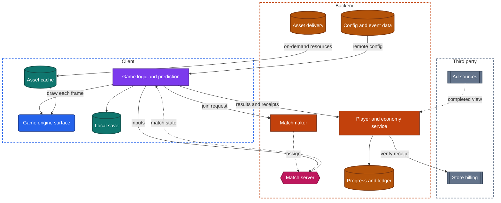
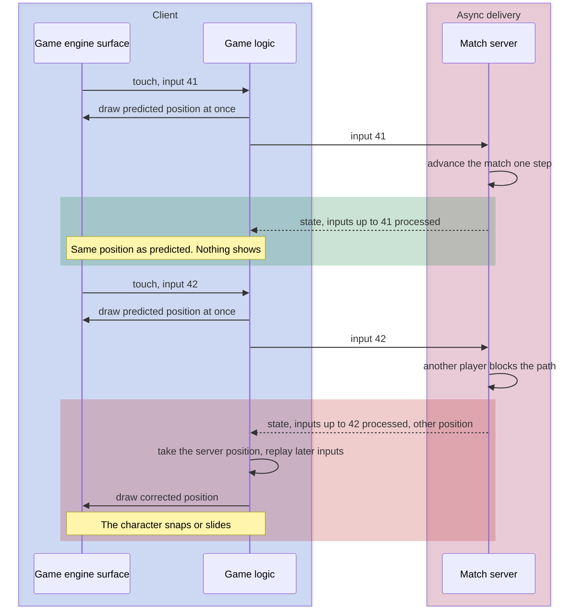

import Probe from '../../../components/Probe.astro';
import Signals from '../../../components/Signals.astro';
import TeardownBar from '../../../components/TeardownBar.astro';
import WorksheetForm from '../../../components/WorksheetForm.astro';

> **The archetype.** An app in which a player acts on a simulated world that is redrawn many times a second, earns and spends progress and currency in it, and in some variants shares that world with other players in real time.

## 52.1 What defines this archetype

A game makes one promise. It responds to every touch instantly, and your progress and purchases are never lost.

The two halves pull in opposite directions.

- **Instantly.** A response has to land within a frame or two. No network round trip fits in that time, so the device must act on its own.
- **Never lost.** Progress and purchases have value, and some of it was paid for. Value cannot be left to a device its owner controls, so the backend must decide.

Every design in this chapter is a way to let the device act first and the backend decide afterwards.

Five concerns dominate.

| Concern | Why it dominates | Chapter |
|---|---|---|
| Performance and UI technology | A game engine redraws one surface every frame, and that sets size, battery and heat | [Chapter 35](/part-2-concerns/35-performance-and-resource-budgets/), [Chapter 32](/part-2-concerns/32-ui-technology-native-cross-platform-and-web/) |
| Security and trust | Scores, currency and purchases are worth cheating for | [Chapter 21](/part-2-concerns/21-security-and-trust/) |
| Offline and sync | The save is a replica that two devices can change | [Chapter 12](/part-2-concerns/12-offline-and-sync/) |
| Remote config | A live game changes weekly, and a release takes longer than that | [Chapter 30](/part-2-concerns/30-remote-config-and-experiments/) |
| Payments and ads | Most games are free to install and earn from store billing and rewarded ads | [Chapter 26](/part-2-concerns/26-payments-and-subscriptions/), [Chapter 27](/part-2-concerns/27-ads-attribution-and-growth/) |

The archetype has three variants. They differ in how much the backend takes part.

| Variant | What the backend does | What the device does |
|---|---|---|
| Casual game that works offline | Stores a copy of the save, serves ads and purchases | Runs the rules and holds the main copy of the save |
| Live-service game | Owns progress, currency, events and prices | Runs each level and reports the result |
| Real-time multiplayer game | Owns the state of every match, tick by tick | Draws the match and predicts the player's own movement |

A product is often a mix. A live-service game may have one real-time mode, and a casual game may add weekly events. Record the variant per mode. Section 52.6 gives the probe that separates them.

## 52.2 Requirements read from the product

These are requirements as a player experiences them. None of them names a design.

**What the game does**

- Play a level or a match, with every touch answered at once.
- Keep progress: levels finished, items owned, currency balances.
- Continue the same progress on a second device, where the product offers it.
- Buy currency or items, and earn them by play or by watching an ad.
- Show events, offers and new levels that change from week to week.
- In the multiplayer variant, find opponents in seconds and play them in real time.
- Show rankings that mean something, because nobody could fake a score.

**Qualities it must have**

- The frame rate is steady. A dropped frame is felt in the hands, not just seen.
- The first play comes soon after install, although the full game is very large.
- A purchase is granted exactly once, whatever the network or the process does afterwards.
- Progress survives a lost device, where the product has accounts.
- A match is the same for every player in it. Nobody's device is believed over another's.
- A long session does not overheat the device or empty the battery faster than the player accepts.

Of the seven constraints of [Chapter 2](/part-1-method/2-the-mobile-constraint-set/), four bind hardest. Human attention sets the frame budget. Limited resources bound what a frame may cost. Untrusted client moves every decision with value to the backend. Slow release is why live operations exist.

## 52.3 Running the probes

Run the general probes first, then the game probes. [Chapter 4](/part-1-method/4-probes/) describes how to run a probe cleanly.

No probe in this chapter tries to gain an advantage, alter saved data or defeat a protection. Probes that change the device clock are left out on purpose. Games treat a changed clock as an attempt to cheat, and some penalize the account. Do not run P12.8 from [Chapter 12](/part-2-concerns/12-offline-and-sync/) on a game.

### Probes from Chapters 32 and 35

These show the engine and its cost. They are defined in [Chapter 32](/part-2-concerns/32-ui-technology-native-cross-platform-and-web/) and [Chapter 35](/part-2-concerns/35-performance-and-resource-budgets/).

| Probe | Typical outcome for a game | What it tells you |
|---|---|---|
| P32.1 Long-press text | Nothing selects anywhere | No platform controls |
| P32.2 Raise the system text size | No screen grows | The engine draws its own text |
| P32.3 Screen reader walk | Focus lands on one large region, or on nothing | One surface. A game engine, Inferred |
| P32.4 Two platforms side by side | Identical on both | One codebase draws every pixel |
| P32.9 App size and startup time | Very large, with a loading screen | An engine, and assets loaded into memory at launch |
| P35.1 App size | A download at first use, and the app figure grows | On-demand resources |
| P35.6 Leave and return | A splash, then the home screen | The process used much memory and was ended |
| P35.7 Low-power mode | A lower frame rate, or no change | Whether an adaptation policy exists |
| P35.8 Sustained use | Warm and adapts, or warm and degrades | Whether the game responds to thermal state |

In P35.8, also leave the game on its home screen for ten minutes. A device that warms there is redrawing a still screen at full rate.

### Probes from Chapters 26 and 27

Run the payment probes of [Chapter 26](/part-2-concerns/26-payments-and-subscriptions/) only as far as the purchase sheet, and cancel there. Run the ad probes of [Chapter 27](/part-2-concerns/27-ads-attribution-and-growth/) as written.

| Probe | Typical outcome for a game | What it tells you |
|---|---|---|
| P26.1 Read the paywall | Digital goods, billed through your store account | Store billing |
| P26.2 Start a checkout and cancel | A system purchase sheet | The store owns the payment |
| P26.4 Paywall in airplane mode | Prices missing, or the shop does not open | Prices come from the store and the backend at run time |
| P26.6 Existing entitlement on a second device | Lasting items unlock after sign-in | The backend records what an account owns |
| P27.1 Ad inventory | Several formats, with rewarded ads the most prominent | An ad-funded economy |
| P27.3 Rewarded ad readiness | Ready at once, or a control that says none is available | Ads are loaded ahead of the break |
| P27.4 Count the full-screen ads | Spaced by count or by time | A frequency limit, usually in remote config |

### Probes from Chapters 30, 21 and 12

| Probe | Typical outcome for a game | What it tells you |
|---|---|---|
| P30.1 Change without an update | Events and offers change at a launch, with the version unchanged | Remote config and content delivered outside a release |
| P30.3 Two accounts side by side | The same offer at a different price or in a different form | An experiment or targeting on the economy |
| P21.1 Offline refusal | Refused in a live-service game. Completed offline in a casual one | Where value is decided |
| P12.2 Offline write and P12.3 Kill while pending | A casual game keeps a level finished offline through a force-quit | A durable save on the device |

P21.1 is defined in [Chapter 21](/part-2-concerns/21-security-and-trust/), and the last row in [Chapter 12](/part-2-concerns/12-offline-and-sync/). The config probes are in [Chapter 30](/part-2-concerns/30-remote-config-and-experiments/).

### Game probes

These eight probes are specific to the archetype. P52.1 examines assets. P52.2 to P52.5 locate the save and the party that decides. P52.6 examines live operations. P52.7 and P52.8 apply only to real-time matches.

<TeardownBar />

### P52.1 First launch download

<Probe id="P52.1" />

### P52.2 Play in airplane mode

<Probe id="P52.2" />

### P52.3 Offline progress after reconnect

<Probe id="P52.3" />

### P52.4 Progress on a second device

<Probe id="P52.4" />

### P52.5 Two devices, two saves

<Probe id="P52.5" />

### P52.6 An event begins

<Probe id="P52.6" />

### P52.7 Movement on a weak connection

<Probe id="P52.7" />

### P52.8 Leave a match and return

<Probe id="P52.8" />

## 52.4 The design, concern by concern

Each subsection states the design this archetype usually takes and the reason. The components are those of the universal app model in [Chapter 3](/part-1-method/3-the-universal-app-model/).

### One surface, redrawn every frame

Of the five families in [Chapter 32](/part-2-concerns/32-ui-technology-native-cross-platform-and-web/), a game takes the fifth. A game engine owns one surface and redraws all of it many times a second. Menus, buttons and text are objects in the scene. Nothing on screen is a control that the operating system knows about.

The engine runs a loop. Each pass reads input, advances the simulation by a small step of time, and draws the result. The loop has a fixed budget per frame. Work that does not fit makes a frame late, and a late frame is a visible stutter.

That loop explains most of what you observe from outside.

- **App size.** The engine itself is tens of megabytes before any content. Content is textures, models and audio, which are far larger than code.
- **Startup.** Assets must be read from storage and prepared for drawing before the first frame of play. That is the loading screen.
- **Battery.** An ordinary app draws when something changes. A game draws all the time, and uses the graphics hardware at a high rate while it does.
- **Heat.** Sustained drawing warms the device. When the operating system reports a high thermal state, a careful game lowers its frame rate or its effects first. A careless one is slowed by the system, and stutters.
- **Platform features.** System text size, the screen reader and text selection do not reach inside the surface. The game must rebuild each one or go without.

A well-built game lowers its rate where it can. A menu or a turn-based board needs far fewer frames than an action scene. The idle check in Section 52.3 shows whether the team did that work.

### Assets downloaded after install

Stores limit, or users resist, a download of several gigabytes. So the install holds the engine, the first screens and little else. The rest arrives as on-demand resources, as described in [Chapter 35](/part-2-concerns/35-performance-and-resource-budgets/).

The client holds a list of asset packs with a content version. At launch it asks asset delivery which packs this app version should have, compares the answer with what is on the device, and downloads the difference. The transfers are large, so they are resumable, as in [Chapter 18](/part-2-concerns/18-file-transfer-uploads-and-downloads/).

Two orderings exist, and P52.1 separates them. A single download before first play is simple and makes the player wait. A staged download ships the first levels early and fetches later packs during play, which demands that the game never needs a pack before it has arrived.

This path also carries change. A new level or a seasonal look is a new pack and a new content version, with no store release. The limit is the one in [Chapter 33](/part-2-concerns/33-releases-and-compatibility/): assets and data may arrive this way, and new compiled code may not.

### Saved progress on the device and on the backend

The save can live in three places, and P52.4 finds which.

| Where the save lives | What survives a lost device | Second device | Typical of |
|---|---|---|---|
| Device only | Nothing | Starts from zero | Small casual games with no account |
| Platform account | Everything, on that platform | Works on the same platform | Casual games |
| Game account on the backend | Everything | Works on either platform | Live-service and multiplayer games |

A casual game treats the device as the main copy and uploads the save as one record. That is Level 2 of [Chapter 12](/part-2-concerns/12-offline-and-sync/) with a single large item. Two devices that both played offline then hold two versions of one record, which is a conflict. Games resolve it in one of four ways.

- **Ask the player.** Show both saves with their level and date, and let the player choose. It is honest and it interrupts.
- **LWW on the whole save.** The later upload wins. An hour of play on the other device vanishes without a word.
- **A domain rule.** Furthest progress wins, or the higher of each counter is kept. This suits values that only grow.
- **The backend copy wins.** A device that was offline discards its session. This is the live-service answer.

A live-service game avoids the conflict by not having a save in this sense. Progress is a set of records on the backend, each changed by a request. Currency is a ledger of grants and spends, so two devices cannot disagree about a balance. P52.5 shows which of these a product chose.

### The untrusted client

A game runs on a device its player controls, and players have a reason to lie. Anything the client reports can be altered: a score, a balance, the time a level took. So the game follows the second posture of [Chapter 21](/part-2-concerns/21-security-and-trust/). The backend decides.

The client sends intent and evidence, never a result with value.

```text
function onLevelFinished(account, levelId, run):
  // the client sends what happened, not what it should earn
  level = config.level(levelId)
  if not account.hasUnlocked(levelId): return Rejected
  if not plausible(run, level): return Rejected   // too fast, too many points, impossible moves
  reward = rewardFor(level, run.stars)             // computed from backend rules
  transaction(backendStore):
    if alreadyRecorded(run.id): return previousResult(run.id)   // the client may retry
    recordProgress(account, levelId, run.stars)
    ledger.grant(account, reward, reason: run.id)
  return Granted(reward, balanceOf(account))
```

Three points in it matter.

First, the reward is computed on the backend from its own rules. The client's display of "plus fifty" is an optimistic update, and the returned balance replaces it.

Second, the backend cannot rerun most levels. It checks that the run is plausible. Stricter designs replay a recorded list of inputs through the same simulation on the backend. From outside you cannot tell which check is used, and you must not test it.

Third, the request is idempotent by a run id. A lost response does not grant twice.

A casual offline game accepts a different trade. The client decides, because the game must work with no network. That is sound while the value is private to the player. It stops being sound when there are rankings or a currency that is sold. P52.3 exposes the choice. A reward that changes after reconnect was recomputed by a backend that did not believe the device.

### Real-time multiplayer

In a real-time match, several devices show one world. Each has a different delay to the backend, and none can be trusted. The usual design gives the match to a backend service, called a match server in this chapter. It owns the true state. It collects every player's input, advances the simulation at a fixed rate, and sends the resulting state to every client over a persistent connection. [Chapter 14](/part-2-concerns/14-real-time-delivery/) covers such connections.

If the client only drew what the match server confirmed, every touch would show after a full round trip. So the client does three things, each of which you can observe.

- **Client prediction.** The client applies your input to your own character at once, using the same movement rules as the match server. It also sends the input, with a sequence number.
- **Correction.** Each state from the match server says which of your inputs it has processed. The client compares its prediction for that moment with the server's answer. If they agree, nothing shows. If they differ, the client takes the server's position and replays the inputs sent since. You see your character snap or slide to another place.
- **Drawing others in the past.** The client cannot predict other players. It draws them a fraction of a second behind, moving smoothly between the last two states received. When states stop arriving, the others freeze, then jump.

```text
function onServerState(state):
  me.position = state.myPosition                // the match server's answer replaces the guess
  pending = pending.after(state.lastInputProcessed)
  for input in pending:
    me.position = applyMovement(me.position, input)   // replay what the server has not seen yet
  others.addSnapshot(state.others, state.time)        // drawn slightly in the past
```

The behavior is the evidence. On a weak connection your own movement stays instant, with occasional snaps, and other players stutter. P52.7 tests this. A hit that looked certain and did not count is the same design seen from the other side: the match server decided from its own state.

Two other designs exist. A turn-based match needs none of this, because each move is a request. A lockstep design runs the same simulation on every device and exchanges only inputs. It suits matches with many units and few players, and it freezes for everyone when one player lags.

### Live operations

Live operations is the practice of changing a shipped game on a schedule: events, prices, level tuning, offers. None of it can wait for a release, so all of it travels as data.

Three channels carry it, and they are separate mechanisms.

| Channel | What it carries | Chapter |
|---|---|---|
| Remote config | Prices, reward amounts, difficulty values, feature flags, ad frequency | [Chapter 30](/part-2-concerns/30-remote-config-and-experiments/) |
| Event and catalog data | The calendar of events, the contents of the shop, level definitions | [Chapter 10](/part-2-concerns/10-api-shape/) |
| Asset packs | Artwork and audio for the above | [Chapter 35](/part-2-concerns/35-performance-and-resource-budgets/) |

An event needs all three to agree. The usual design delivers the data and the assets days ahead, with a start time on the backend's clock. The client shows a countdown and switches at zero. P52.6 shows whether a product does this or fetches at the next launch.

The backend's clock is the only one used. The client learns the backend's time on each response and measures elapsed time from that. A schedule read from the device clock could be moved by its owner, which is why a changed clock is treated as cheating, and why this chapter has no clock probe.

Prices and difficulty are the most tested values in a game. Two accounts that see different offers are in different experiment variants or different targeting groups. P30.3 detects it.

### Store billing, rewarded ads and the economy

A game sells digital goods used in the app, so purchases go through store billing, as [Chapter 26](/part-2-concerns/26-payments-and-subscriptions/) explains. The flow is the receipt flow of that chapter with one difference. Most purchases are of currency, which is used up, so there is no lasting entitlement to restore.

That raises the cost of a failure between payment and grant. The design closes it in three steps.

- The client sends the receipt to the backend, which verifies it with the store and adds to the ledger. The purchase id is the idempotency key.
- Only after the grant does the client tell the store that the purchase is finished.
- At every launch the client asks the store for unfinished purchases and sends each one again.

A crash after payment therefore ends in a grant at the next launch, exactly once.

A typical economy has two currencies. One is earned by play. The other is mostly bought, and the valuable items cost it. Both are ledgers on the backend. The shop is catalog data, so its contents and prices change without a release.

Rewarded ads are the third source. The player chooses to watch an ad in exchange for currency, a retry or a shorter wait. [Chapter 27](/part-2-concerns/27-ads-attribution-and-growth/) covers loading ahead and the two ways to grant. For a game the stricter one matters: the ad source confirms the completed view to the game's backend, and the backend grants. The daily limit on views is a counter on the backend, for the reason any limit is.

### Matchmaking

Matchmaking places players into a match. It is a queue on the backend with a rule.

The client sends a request to join: a mode, a group if any, and measurements of delay to each region. The matchmaker holds waiting requests and looks for a set that is close in skill, close in delay and the right size. It then assigns a match server and sends its address to each client.

The rule trades quality against waiting. A strict rule gives even matches and long waits. So the criteria widen as a request ages. After some seconds the skill range grows, then the region. Some games fill the last places with computer opponents.

You see only the outside. Note the waiting time at a busy hour and a quiet one, how even the matches feel, and whether opponents at low ranks behave like people. Each reading is Speculative, because a large player pool explains a short wait as well as computer opponents do.

## 52.5 End-to-end architecture

Figure 52.1 shows the components that the probes imply for a live-service game with a real-time mode.



*Figure 52.1. The client and backend of a live-service game with a real-time mode.*

In the terms of the universal app model, the game engine surface is the UI, the game logic holds screen state and domain logic, and the local save and asset cache are the local store. The match server is async delivery that also computes. Asset delivery is media delivery under another name. A casual offline game keeps the top zone, a small player service and the third parties, and drops the rest.

Figure 52.2 follows one movement input in a real-time match, once when the prediction holds and once when it does not.



*Figure 52.2. One movement input in a real-time match. The client predicts, and the match server's state confirms or corrects.*

The same shape, slower, describes a level result in a live-service game. The client shows the reward at once, the backend computes the real one, and the returned balance replaces the guess.

## 52.6 Variants and how to tell them apart

Two probes place a game among the three variants. [Chapter 5](/part-1-method/5-from-signal-to-inference/) describes how a signal becomes a claim.

| Question | Discriminating probe | Reading |
|---|---|---|
| Does play need the backend at all | P52.2 | Full play offline is the casual variant. A connection screen is live-service or multiplayer |
| Who decides progress and value | P52.3, with P21.1 | Rewards that change after reconnect were decided by the backend |
| Where the save lives | P52.4, then P52.5 | Platform account, game account, or device |
| How change arrives | P52.6, with P30.1 | Live operations, or releases only |
| Who owns a real-time match | P52.7 and P52.8 | Prediction with corrections and a match that runs on without you mean a match server |

**Casual against live-service.** The honest limit is that a connection screen proves a product decision, not a technical need. A single-player game that refuses to start offline may do so to protect its economy, to show ads, or from habit. Record the behavior as Observed and the reason as Speculative.

**Match server against device-hosted.** Some small games run the match on one player's device, and the other devices connect to it. From outside, the sign is that the match ends or pauses for everyone when one particular player leaves. You rarely get to see that on purpose, so the claim usually stays Speculative.

**One save against a ledger.** P52.5 is the only probe that separates them, and it costs progress. If you skip it, leave the field at "not testable".

The signal table collects the behaviors from the probes and from normal play.

<Signals chapter={52} />

## 52.7 What changes with scale

**The same at every size**

- One surface, redrawn every frame by a game engine.
- The backend decides anything with value as soon as a ranking or a sold currency exists.
- Receipts are verified on the backend, and grants are idempotent.
- Client prediction with correction, wherever a match is real-time.

**What changes**

- **Assets.** A small game ships everything in the install. A large one runs asset delivery with content versions, edge caches and staged downloads.
- **Match servers.** A small game runs matches in one region. A large one starts and stops match servers by demand in many regions, and the matchmaker chooses by measured delay.
- **Matchmaking.** A small player pool forces wide criteria or computer opponents. A large pool affords narrow skill ranges and separate queues per mode.
- **Live operations.** A small team edits config by hand. A large one runs a calendar, experiments on every price, and separate schedules per region.
- **Integrity.** A small game checks plausibility. A large competitive one adds replay of inputs, analysis of play patterns and a hardened client.
- **The economy.** One counter in a save becomes a ledger service with an audit trail, because refunds and support cases need history.

From outside you see the products of these: regional queues, different offers per account, downloads in stages, a stated device integrity requirement. Each is a Speculative signal of scale, since a product decision explains it equally well.

## 52.8 Completed worksheet

[Chapter 6](/part-1-method/6-the-teardown-worksheet/) describes the worksheet and the order in which to fill it in. The fields in this form are specific to games. The probes of Section 52.3 fill most of them.

<TeardownBar />

<WorksheetForm chapters={[52]} />

The table gives typical values for a live-service game with a real-time mode, with the casual offline value where it differs. A value that differs in your teardown is a finding.

| Field | Typical value | Casual offline game | Confidence |
|---|---|---|---|
| Dominant UI family, [Chapter 32](/part-2-concerns/32-ui-technology-native-cross-platform-and-web/) | Game engine | The same | Inferred |
| Asset delivery | Downloaded in stages | All in the install | Inferred |
| Posture, [Chapter 35](/part-2-concerns/35-performance-and-resource-budgets/) | Adaptive in play, often unmanaged in menus | Reactive | Inferred |
| Play with no network | Connection required | Plays fully | Observed |
| Offline progress after reconnect | Not testable | Kept after reconnect | Observed |
| Where the save lives | Game account on the backend | Platform account | Inferred |
| Two saves from two devices | Backend copy wins | Asks which to keep, or one save wins silently | Inferred |
| Posture, [Chapter 21](/part-2-concerns/21-security-and-trust/) | The backend decides | The client decides | Inferred |
| Payment route, [Chapter 26](/part-2-concerns/26-payments-and-subscriptions/) | Store billing | The same | Observed |
| How an event arrives | Applied while open | Only with a store update | Inferred |
| When config is applied, [Chapter 30](/part-2-concerns/30-remote-config-and-experiments/) | Mixed. Live for events, at launch for tuning | Cached and applied next launch | Inferred |
| Own movement in a real-time match | Predicted with corrections | No real-time matches | Inferred |
| Return to a match | Rejoins a running match | No real-time matches | Inferred |
| Backend components implied | Player and economy service, progress and ledger, config and event data, asset delivery, matchmaker, match servers, store and ad sources as third parties | Save copy, ads and store | Inferred |

## 52.9 As an interview question

The question is usually asked as "design the client and backend for a multiplayer mobile game", or as a narrower piece: a leaderboard, an in-game shop, matchmaking.

**Clarify first.** Ask three things, because each one removes or adds most of the design.

1. Real-time, turn-based or single-player.
2. Whether the game must play offline.
3. Whether currency is sold and rankings are public.

Then state the promise from Section 52.1 and the tension in it. The device must act first, and the backend must decide.

**Go deep on three concerns.**

- **The untrusted client.** The client sends intent and evidence. The backend computes rewards, holds currency as a ledger, verifies receipts and makes every grant idempotent. Say what plausibility checks can and cannot catch.
- **Real-time state.** A match server that owns the state, client prediction for the player's own movement, correction by replaying unprocessed inputs, and other players drawn slightly in the past. Draw Figure 52.2 from memory.
- **Change without a release.** Remote config for values, catalog data for the shop and events, asset packs for content, all scheduled on the backend's clock.

**Trade-offs an interviewer expects to hear.**

- A match server against lockstep: bandwidth and backend cost against a simulation that must be identical on every device.
- Offline play against a trusted economy. You cannot have both for the same value.
- One download before first play against staged downloads: simplicity against time to first play.
- Asking the player to resolve a save conflict against a silent rule.
- Strict matchmaking against waiting time, and when to widen.
- Frame rate against battery and heat, and what to lower first.

Leave chat, friends and clans until the core is drawn. They are a small messaging app inside the game.

## 52.10 Summary

- A game promises an instant response to every touch and no loss of progress or purchases. The device acts first, and the backend decides.
- A game engine redraws one surface every frame. That explains the large app, the loading screen, the battery use, the heat and the absence of platform controls.
- Most of a game arrives after install as on-demand resources, and the same path delivers new content without a release.
- The save lives on the device, in the platform account or on the backend. Two devices can conflict over a save, and P52.5 shows the rule.
- The client is untrusted. Where value exists, the client sends intent, and the backend computes rewards, keeps currency as a ledger and verifies receipts.
- In a real-time match, a match server owns the state. The client predicts your movement, corrects itself when the server disagrees, and draws other players slightly in the past.
- Live operations change events, prices and levels through remote config, catalog data and asset packs, on the backend's clock.
- Three variants cover the archetype: casual offline, live-service and real-time multiplayer. P52.2, P52.3 and P52.7 separate them.
