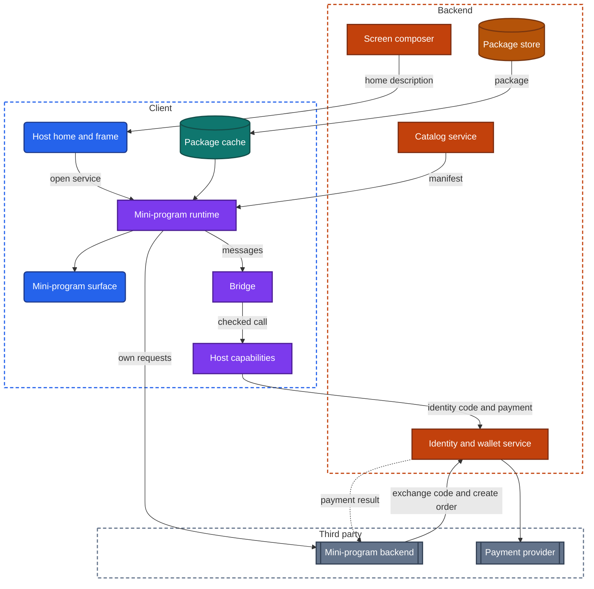
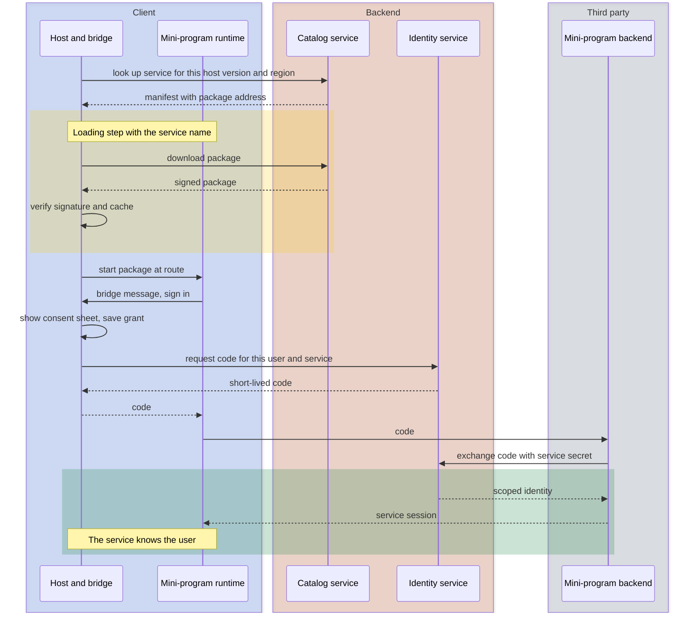

import Probe from '../../../components/Probe.astro';
import Signals from '../../../components/Signals.astro';
import TeardownBar from '../../../components/TeardownBar.astro';
import WorksheetForm from '../../../components/WorksheetForm.astro';

> **The archetype.** An app that hosts many unrelated services, such as rides, food, bills, shopping and tickets, and gives each of them the same identity, payment, navigation and permissions.

## 53.1 What defines this archetype

A super-app makes one promise. Many services sit behind one icon, one sign-in and one wallet.

Each part of the promise is a job the app takes away from the services.

- **One icon.** The user installs once. A service they have never used is one tap away, with no visit to the store.
- **One sign-in.** A service knows who the user is without asking, or after one consent.
- **One wallet.** Every service is paid in the same way, from the same balance and saved methods.

The app that does these jobs is the host app. A service inside it is, in the open variant, a mini-program: a small program that the host downloads and runs in a sandbox. The host is closer to a small operating system than to an app. Its design is about what it provides, what it withholds, and how it keeps one service from reaching another.

Four concerns dominate.

| Concern | Why it dominates | Chapter |
|---|---|---|
| Modularity and team scale | The app is built by many teams or many companies, and the user can see where they meet | [Chapter 38](/part-2-concerns/38-modularity-sdks-and-team-scale/) |
| UI technology | Each service may be drawn by a different family, joined to the host by a bridge | [Chapter 32](/part-2-concerns/32-ui-technology-native-cross-platform-and-web/) |
| Server-driven UI and remote config | The backend decides which services exist for each user and region | [Chapter 31](/part-2-concerns/31-server-driven-ui/), [Chapter 30](/part-2-concerns/30-remote-config-and-experiments/) |
| Identity and payments | They are the two things every service borrows from the host | [Chapter 20](/part-2-concerns/20-identity-and-sessions/), [Chapter 26](/part-2-concerns/26-payments-and-subscriptions/) |

The archetype has two variants.

| | One company's services | Open platform |
|---|---|---|
| Who writes a service | Teams inside the company | Other companies |
| How a service ships | Compiled into the app as a feature module, or as web content | As a mini-program package, outside the store |
| Trust between host and service | Full | None. The service is sandboxed |
| Backend of a service | Part of the company's backend | The other company's own backend |
| Identity given to a service | The account itself | A scoped identity, by consent |

Many products are a mix. The core services are compiled in, and a long tail is open to partners. Record the variant per service. Section 53.6 gives the probes that separate them.

## 53.2 Requirements read from the product

These are requirements as a user experiences them. None of them names a design.

**What the app does**

- Show a home screen of services, suited to the user's region and habits.
- Open any service, including one never used before, without an install.
- Let a service know the user without a second sign-in.
- Pay in any service with the same wallet and the same confirmation.
- Ask for location, camera or contacts per service, so that a grant to one is not a grant to all.
- Find a service by search, by a link or by a scanned code.
- Add, change and remove services without an update of the app.

**Qualities it must have**

- The host starts fast, although it carries the means to run everything.
- A first open of a service takes a second or two, not a visit to the store.
- A faulty service cannot crash the host, read another service's data or draw over the host's controls.
- A payment is confirmed by the host, in a screen a service cannot imitate.
- The app stays small enough to install on a cheap phone.
- A service still works when the host is several versions old.

Of the seven constraints of [Chapter 2](/part-1-method/2-the-mobile-constraint-set/), three bind hardest. Slow release is the reason services ship outside the store. Platform rules limit how far that may go. Untrusted client applies twice: the backend does not trust the host, and the host does not trust a mini-program.

## 53.3 Running the probes

Run the general probes first, on several services each. A super-app is not one app, and a result from one service says little about the next. [Chapter 4](/part-1-method/4-probes/) describes how to run a probe cleanly.

### Probes from Chapters 38 and 32

These find the borders between services and the family that draws each one. They are defined in [Chapter 38](/part-2-concerns/38-modularity-sdks-and-team-scale/) and [Chapter 32](/part-2-concerns/32-ui-technology-native-cross-platform-and-web/).

| Probe | Typical outcome for a super-app | What it tells you |
|---|---|---|
| P38.3 Compare the look of each area | Most areas differ on an open platform. One or two differ in a single company's app | How strong the shared design system is |
| P38.4 Compare the behavior of each area | Behavior differs at the same borders where the look differs | A border between teams or companies |
| P38.5 First use of a feature | A loading step once, and the app's data grows | A package fetched at first use |
| P38.7 App size against feature count | Small for its feature count, yet large in absolute terms | Services live outside the install, and the host itself is heavy |
| P32.1 Long-press text | Differs by service | The family per service |
| P32.5 Each screen in airplane mode | The host's screens draw. Services draw a frame or fail whole | Which services keep code on the device |
| P32.8 The seam | Seamless on the platform's own services. A second sign-in on a guest web page | Whether the bridge passes the session |

Run P32.1 and P32.3 in at least six services and fill in the family for each. The list of families is the most reliable output of this section.

### Probes from Chapters 31 and 30

Run these on the home screen. They are defined in [Chapter 31](/part-2-concerns/31-server-driven-ui/) and [Chapter 30](/part-2-concerns/30-remote-config-and-experiments/).

| Probe | Typical outcome for a super-app | What it tells you |
|---|---|---|
| P31.1 Structure change without an update | Known blocks reorder, appear or vanish, and new services arrive | The home screen is described by the backend |
| P31.2 Arrangement across refreshes | Varies within a day | Ranking per user, and campaigns |
| P31.5 Where taps lead | The same position leads to a native screen, a mini-program or a web page | An action handler that routes by kind of destination |
| P30.3 Two accounts side by side | One account has a service the other lacks | Targeting, or a staged rollout of a service |
| P30.8 Region setting | Services appear or disappear with the region | Targeting by region |

### Probes from Chapters 20 and 26

Run P20.1 and P20.4 from [Chapter 20](/part-2-concerns/20-identity-and-sessions/) on the host, then check one service. A typical host trusts its session locally and opens offline. After you remove a device from the device list, a service on that device should fail at its next request, because its access rests on the host session.

Run P26.1, P26.2 and P26.9 from [Chapter 26](/part-2-concerns/26-payments-and-subscriptions/) on the wallet, and cancel at the confirmation. A typical host sells physical goods and services through an external payment provider or a wallet balance, shows saved methods as a masked list, and draws the confirmation itself. Digital goods, where a service sells them, go through store billing. Section 53.4 explains why.

### Super-app probes

These eight probes are specific to the archetype. P53.1, P53.6 and P53.7 examine how a service is loaded and kept. P53.2, P53.3 and P53.4 examine what the host owns. P53.5 examines the home screen, and P53.8 the frame.

<TeardownBar />

### P53.1 First open of a service

<Probe id="P53.1" />

### P53.2 Identity across services

<Probe id="P53.2" />

### P53.3 Payment sheet in two services

<Probe id="P53.3" />

### P53.4 Location in two services

<Probe id="P53.4" />

### P53.5 Home screen on two accounts

<Probe id="P53.5" />

### P53.6 Leave a service and return

<Probe id="P53.6" />

### P53.7 Storage after exploring

<Probe id="P53.7" />

### P53.8 The frame around each service

<Probe id="P53.8" />

## 53.4 The design, concern by concern

Each subsection states the design this archetype usually takes and the reason. The components are those of the universal app model in [Chapter 3](/part-1-method/3-the-universal-app-model/).

### The host app and what it owns

The host owns four things, and a service owns none of them.

| The host owns | What a service gets | Why the host keeps it |
|---|---|---|
| Identity | A scoped identity for this user, after consent | One sign-in, and no service ever holds the user's credentials |
| Payment | A request to collect an amount, and a result | One wallet, and a confirmation no service can imitate |
| Navigation | A surface to draw in, under a frame it cannot remove | The user can always leave, and always knows whose screen this is |
| Permissions | A capability, if the user granted it to this service | A grant to one service is not a grant to all |

Everything else belongs to the service: its screens, its logic, its data and its backend.

In the one-company variant the same four are shared modules under feature modules, as in [Chapter 38](/part-2-concerns/38-modularity-sdks-and-team-scale/). A feature calls the session and the payment module directly, because the code is trusted. In the open variant the four are capabilities behind a bridge, because the code is not.

### What a mini-program is

A mini-program is a package of non-compiled code and assets, plus a manifest. The manifest names the service, its version, the lowest host version it needs and the capabilities it will ask for. The host downloads the package and runs it in a mini-program runtime.

The runtime can draw in three ways. [Chapter 32](/part-2-concerns/32-ui-technology-native-cross-platform-and-web/) names the families.

| How the runtime draws | What runs the logic | Signature from outside |
|---|---|---|
| Embedded web content | A script engine inside the page | Any text selects, other web tells, a page-style loading bar |
| Web content for the view, logic in a separate interpreter | An interpreter beside the page | Web tells in the content, smoother input, a host frame that never reloads |
| The platform's own controls, mapped from the package's description | An interpreter | Platform controls and scrolling, with a layout that is identical on both platforms |

The web tells are listed in [Chapter 31](/part-2-concerns/31-server-driven-ui/). All three are the same idea. The code is interpreted, so it can be delivered outside the store, and it is sealed in a sandbox, so it can be written by a stranger.

The sandbox has four walls.

- **No direct access to the device.** The package cannot call the operating system. It can only send messages to the host.
- **A storage area of its own.** One mini-program cannot read another's stored data.
- **A network allowlist.** The package may reach only the domains its author registered with the platform.
- **A frame it cannot draw over.** The host draws the title and a close control above the mini-program's surface.

A simpler form skips the package. The service is a web page loaded from the network into a web view, with a bridge attached. It needs no runtime, and it loads every time and fails offline. P53.1 separates the two.

### The bridge

A mini-program reaches the host through a bridge, which [Chapter 32](/part-2-concerns/32-ui-technology-native-cross-platform-and-web/) defines as a narrow set of messages that the host chooses to answer. In a super-app the bridge is the whole public interface of the platform. Sign-in, payment, location, camera, scanning, sharing and storage are each a message.

Every message is checked before the host acts.

```text
function onBridgeMessage(miniProgram, message):
  if not hostSupports(message.name): return NotSupported     // an old host, a new package
  if not manifestDeclares(miniProgram, message.name): return Denied
  capability = capabilityFor(message.name)                   // location, camera, identity, payment
  match grantFor(miniProgram.id, capability):
    Granted: return perform(message)
    Refused: return Denied
    NotAsked:
      answer = showHostSheet(miniProgram.name, capability)   // drawn by the host, names the service
      saveGrant(miniProgram.id, capability, answer)
      return answer is Granted ? perform(message) : Denied
```

Two details of it show from outside.

First, the grant is keyed by mini-program. The operating system grants location to the host once. The host then keeps a second layer of grants, one per service, and draws its own sheet for each. P53.4 exposes this layer. [Chapter 22](/part-2-concerns/22-privacy-permissions-and-consent/) covers the consent record behind it.

Second, the bridge has versions. A package written last week may call a message that a host installed last year does not have. A careful package asks what the host supports and hides the feature. A careless one shows a button that does nothing. That failure is the compatibility problem of [Chapter 33](/part-2-concerns/33-releases-and-compatibility/), turned around: here the old client is the platform.

### Loading on first use, and caching

The first open of a service is the moment the archetype is won or lost. It must be far quicker than an install.

```text
function openMiniProgram(id, route):
  cached = packageCache.get(id)
  if cached is none:
    manifest = catalog.lookup(id, hostVersion, region)   // may answer: not available here
    package = download(manifest.url)
    verifySignature(package, manifest)                   // signed by the platform, not by the author
    packageCache.put(id, package)
    cached = package
  else:
    checkForNewVersionInBackground(id)                   // applied at the next open
  runtime = runtimePool.take()                           // started ahead of time
  runtime.start(cached, route)
```

Several choices in it are visible.

- **Small packages.** Platforms cap the package size, often at a few megabytes. Larger services split into a main package and parts fetched on entering a section.
- **Stale-while-revalidate for code.** A cached package opens at once, and a newer one replaces it for the next open. A change therefore arrives one open late. A forced minimum version in the manifest overrides this when a fix cannot wait.
- **A prepared runtime.** Starting an interpreter takes longer than loading a small package. The host starts one while the home screen is idle and hands it to the first service opened.
- **Eviction.** Packages and their data areas count against the host's storage. The host removes the least recently used ones. A service unused for months shows its loading step again.

The package is signed by the platform after review, and the host verifies the signature. Without that, the download would be a way to run any code inside a trusted app.

How many services stay alive at once is a memory decision. Each live runtime holds an interpreter and a surface. Hosts keep a few and discard the oldest, and P53.6 shows the result.

### Identity and payment through the host

A service has its own backend, and that backend must learn who the user is without ever seeing the host's session. The usual design is an exchange.

The mini-program asks the bridge to sign in. The host backend issues a short-lived code for this user and this mini-program. The mini-program sends the code to its own backend. That backend presents the code, with its own secret, to the host backend and receives a scoped identity: an identifier for the user that is valid only for this service. Name and phone number are released separately, each behind a consent sheet.

The scoped identifier matters. Two services that compare their records cannot match users, because each was given a different identifier for the same person.

Payment follows the same shape. The service's backend creates an order with the host's payment service and receives an order reference. The mini-program passes the reference to the bridge. The host draws the confirmation, with the amount and the service's registered name, and collects the user's proof. The result goes to the service's backend through a provider callback, as in [Chapter 26](/part-2-concerns/26-payments-and-subscriptions/). The mini-program learns the outcome and never sees a card or a balance.

Both flows keep the valuable step inside the host's own screens. That is the posture of [Chapter 21](/part-2-concerns/21-security-and-trust/), applied one level up: the host decides, and the mini-program sends intent.

### Permissions and data separation

Separation has three parts, and each has a signature.

| What is separated | How | What you can observe |
|---|---|---|
| Device permissions | A grant per mini-program above the system's grant | A second service asks again, P53.4 |
| Stored data | A storage area per mini-program, with a size limit | A settings screen that lists and clears services one by one, P53.7 |
| Profile data | Released item by item through consent sheets | A saved address in one service is unknown to the next |

The one-company variant often has none of this. Every feature reads one profile and one address book, and one system grant covers all. That is reasonable where one company answers for everything. On an open platform the same behavior means that any partner can read what any other collected.

### A home screen the backend describes

The home screen of a super-app is the clearest case for [Chapter 31](/part-2-concerns/31-server-driven-ui/). No release could keep up with a list of services that changes weekly and differs by city. So the home screen is a screen-describing response. It names the sections, the services in each, their icons and badges, and the action behind each tile.

The action is the important part. A tile's action names a kind of destination: a native screen, a mini-program with a route, or a web page. The action handler in the host routes each kind. A service can therefore move from web page to mini-program to native screen with no change to the home screen and no release. Links and scanned codes use the same route. A link names a mini-program and a path, and the host downloads the package first if it must. [Chapter 8](/part-2-concerns/8-navigation-deep-links-and-screen-state/) covers the link side.

Which services appear is decided by targeting, the mechanism of [Chapter 30](/part-2-concerns/30-remote-config-and-experiments/). Region comes first, because a ride service exists only where it operates and a payment service only where it is licensed. App version, account age and experiments follow. A service that is switched off for a region is absent from search as well as from the grid, because the catalog lookup refuses it.

The home description is cached, so the host draws its last known grid at once and refreshes it. The grid that fills in or reorders a moment after launch is that refresh.

### A shared design system, or visibly different areas

The two variants look different, and the look is evidence.

A single company can impose one design system on every team. When it does, P38.3 finds one look throughout, and the seams show only in behavior: one area refreshes by pulling, the next does not. When it does not, each area looks like the product of its own team, which it is.

An open platform cannot impose a look. It offers a component set and guidelines, and authors follow them loosely. What the platform can impose is the frame. The same close and menu control sits in the same corner of every mini-program, drawn by the host. P53.8 looks for it. A host frame over content that differs in look is the strongest single sign of an open platform.

Record every seam, as [Chapter 32](/part-2-concerns/32-ui-technology-native-cross-platform-and-web/) advises. In this archetype a seam is rarely an accident. It marks where one author's responsibility ends.

### App size and the startup cost of hosting everything

The host pays for services the user never opens.

- **Size.** The host carries the runtime, a web engine or its supporting code, and every capability a mini-program might call: maps, camera, scanning, payment, media. The install is large even with no service in it. [Chapter 35](/part-2-concerns/35-performance-and-resource-budgets/) covers the size budget.
- **Startup.** Each capability and each compiled service wants to initialize at launch. A host that lets them is slow to its first frame. The design in [Chapter 7](/part-2-concerns/7-launch-and-startup/) is deferred and lazy initialization: draw the cached home screen first, start the runtime when idle, and start a capability at its first use.
- **Memory.** Live runtimes compete with the host for memory, and the operating system ends the whole process when it runs short.
- **Storage.** Packages and data areas accumulate until the host evicts them.

In the one-company variant the cost is of a different kind. Every team's code is compiled in, so size grows with the number of teams. On-demand modules move some of it to first use, and P38.5 detects that.

### What the platform rules allow

A host that runs other companies' code is doing, inside an app, what the store exists to control. Stores publish rules for this, the rules differ between platforms, and they change. Read the current published rules before you make a claim about any product. Three general limits recur.

- **Interpreted code only.** As [Chapter 33](/part-2-concerns/33-releases-and-compatibility/) explains, a reviewed app may run non-compiled code in an interpreter it ships. It may not download new compiled code.
- **Digital goods go through store billing.** The rule of [Chapter 26](/part-2-concerns/26-payments-and-subscriptions/) applies to a mini-program as it does to the host. A service that sells physical goods may use the wallet. One that sells digital goods may have to use store billing, or be withheld on that platform.
- **The host answers for its guests.** The host is expected to review mini-programs, to keep them within the store's content rules, and to remove one on request.

The visible result is asymmetry. The same super-app may offer a service on one platform and not on the other, or sell something in one and only display it in the other. Record the difference as Observed. Its cause is Speculative, because a product decision explains it equally well.

## 53.5 End-to-end architecture

Figure 53.1 shows the components that the probes imply for the open-platform variant.



*Figure 53.1. The host app, one mini-program and the backends behind them, in the open-platform variant.*

In the terms of the universal app model, the host capabilities are platform services seen from the mini-program's side, the package cache is part of the local store, and the package store sits behind media delivery. The mini-program's backend is a third party to the host. In the one-company variant the runtime, the bridge and the package cache disappear. The services become feature modules that call the host capabilities directly, and their backends move into the backend zone.

Figure 53.2 follows the first open of a service that the user has never used, up to the point where the service knows who the user is.



*Figure 53.2. First open of a mini-program, from the tap to a scoped identity.*

On the second open, the yellow phase is absent, the consent sheet does not show, and the exchange repeats without the user seeing it. A payment adds one more loop of the same shape, with an order reference in place of the code.

## 53.6 Variants and how to tell them apart

No single probe separates the two variants. Four together do. [Chapter 5](/part-1-method/5-from-signal-to-inference/) describes how signals combine into a claim.

| Probe | One company's services | Open platform |
|---|---|---|
| P53.1 First open | Opens at once, or loads a web page every time | A loading step once, with the service's name |
| P53.2 Identity | Shared silently | Released by a host consent sheet |
| P53.4 Location | One grant for the whole app | A host grant per service |
| P53.8 Frame | One look throughout, or website parts inside | A host frame over differing content |

Four results in the right column make the open platform Inferred. A mixed column means a mixed product, and the per-service list is then the finding.

**Mini-program package against web page.** Both show web tells, so [Chapter 32](/part-2-concerns/32-ui-technology-native-cross-platform-and-web/) alone cannot separate them. P53.1 does. A package loads once and keeps its frame offline. A page loads every time and shows nothing offline. A page with a strong cache sits between the two, and the claim is then Speculative.

**Compiled feature against on-demand module against mini-program.** All three can show a loading step at first use. An on-demand module is delivered by the store, so the app figure grows, as in P38.5. A mini-program is delivered by the host's backend, so the data figure grows and the app figure does not. P53.7 reads both figures for this reason.

**What you cannot see.** The review a platform applies to its mini-programs, the network allowlist, the size cap and the signing of packages leave no trace for a user. A platform's published documentation for authors states them, and what it states is Observed as a published fact. Anything else about them is Speculative.

The signal table collects the behaviors from the probes and from normal use.

<Signals chapter={53} />

## 53.7 What changes with scale

**The same at every size**

- The host owns identity, payment, navigation and permissions.
- A service reaches the host only through a defined interface, whether a module's public interface or a bridge.
- The home screen is described by the backend.
- Valuable steps, such as consent and payment confirmation, are drawn by the host.

**What changes**

- **From modules to a platform.** A small super-app is feature modules with shared services. It becomes a platform when outside authors arrive, and then needs a runtime, a sandbox, a review process, author tools and documentation.
- **The catalog.** Ten services fit a fixed grid. Thousands need search, categories, ranking and a recently used list, which is the discovery problem of [Chapter 28](/part-2-concerns/28-search-and-discovery/).
- **Package delivery.** A handful of packages can be bundled with the app. A large catalog needs edge caches, differences between versions sent as small updates, and prefetching of the packages a user is likely to open.
- **The bridge.** A small bridge grows into hundreds of messages, each with a version and a permission. Old hosts stay in use for years, so every message is supported for years.
- **Isolation.** One shared runtime becomes one runtime per service, then a separate process per service where the operating system allows, so that a crash stays contained.
- **Regions.** One catalog becomes one per country, with different services, payment methods and rules in each.

From outside you see only the products of these: a search box over the services, a per-service storage list, a home screen that differs by city. Each is a Speculative signal of scale.

## 53.8 Completed worksheet

[Chapter 6](/part-1-method/6-the-teardown-worksheet/) describes the worksheet and the order in which to fill it in. The fields in this form are specific to super-apps. The probes of Section 53.3 fill most of them.

<TeardownBar />

<WorksheetForm chapters={[53]} />

The table gives typical values for each variant. A value that differs in your teardown is a finding. Record it with the probe that produced it.

| Field | One company's services | Open platform | Confidence |
|---|---|---|---|
| First open of a service | Compiled in, or loads every time | Package downloaded once | Inferred |
| Identity across services | Shared silently | Released by host consent | Inferred |
| Payment across services | Own screen on shared methods | One host payment sheet | Inferred |
| Device permissions across services | One grant for the whole app | Host grant per service | Inferred |
| Home screen across accounts and regions | Order differs | Set differs | Inferred |
| Return to a service | Kept as left | Kept as left for a few, then restarts | Inferred |
| Storage after opening new services | Barely changes | Grows and listed per service | Inferred |
| Frame around each service | One look throughout | Host frame over differing content | Inferred |
| UI family per service | Platform toolkit, with some embedded web content | Embedded web content or mapped controls inside the runtime | Inferred |
| Download at first use, [Chapter 38](/part-2-concerns/38-modularity-sdks-and-team-scale/) | None seen, or downloaded once | Downloaded once | Observed |
| Home screen level, [Chapter 31](/part-2-concerns/31-server-driven-ui/) | Backend-ordered sections | Component list | Inferred |
| Targeting by region, [Chapter 30](/part-2-concerns/30-remote-config-and-experiments/) | Region setting changes features | The same | Observed |
| Backend components implied | Gateway, one service per feature, screen composer, config service, identity and payment services | The same for the host, plus a catalog service, a package store, a review pipeline and each author's backend as a third party | Inferred |

## 53.9 As an interview question

The question is usually asked as "design a super-app", "design a mini-program platform", or "our app has forty teams, how should it be structured". The third form is the same question with the sandbox removed.

**Clarify first.** Ask three things.

1. Who writes the services: teams in one company, or outside companies.
2. Whether a service must ship without an app release.
3. What every service needs from the host. Identity and payment are the usual answers.

The first answer decides whether you need a sandbox at all. Say so, and choose feature modules if the code is trusted.

**Go deep on three concerns.**

- **The boundary.** What the host owns, and the bridge as the only way through. Give the check on each message: host version, manifest, grant per mini-program. Explain why consent and payment confirmation are drawn by the host.
- **Loading.** Catalog lookup, signed package, cache, background update applied at the next open, a prepared runtime, eviction. Draw Figure 53.2 from memory.
- **Identity for a third party.** A short-lived code exchanged between two backends for a scoped identifier, so that the service never holds the host's session and two services cannot match their users.

**Trade-offs an interviewer expects to hear.**

- Web content against mapped platform controls for the runtime: reach and ease for authors against feel and performance.
- A cached package applied at the next open against always fetching the latest: speed against how fast a fix lands.
- One runtime per service against a shared one: isolation against memory.
- A strict shared design system against freedom for authors.
- Compiled feature modules against mini-programs for the company's own services: performance and offline behavior against release independence.
- What the store's rules allow, and that you would read them before committing to a design.

Leave the catalog's search and ranking until the core is drawn. They reuse designs from other chapters.

## 53.10 Summary

- A super-app promises many services behind one icon, one sign-in and one wallet. The host app is closer to a small operating system than to an app.
- The host owns identity, payment, navigation and permissions. A service borrows them and owns everything else.
- The archetype has two variants: one company's services, built as feature modules, and an open platform that hosts mini-programs written by other companies.
- A mini-program is a package of non-compiled code that runs in a sandbox and reaches the host only through a bridge. The host checks every message against its own version, the manifest and a grant per mini-program.
- A package is downloaded on first use, verified, cached, updated in the background and evicted when unused. A loading step that appears once is its signature.
- A service's backend learns who the user is through a code exchanged with the host backend for a scoped identity. Payment follows the same shape, and the host draws the confirmation.
- The home screen is described by the backend, and targeting decides which services appear in each region.
- The host pays in size, startup time and memory for everything it can run, and platform rules limit what it may run. P53.1, P53.2, P53.4 and P53.8 together separate the variants.
