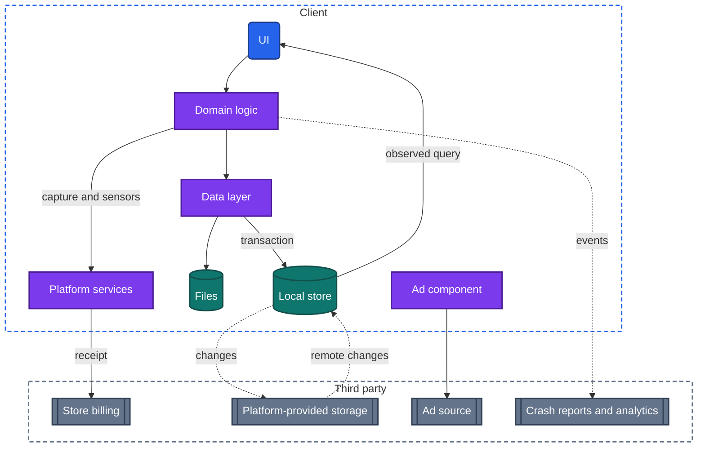
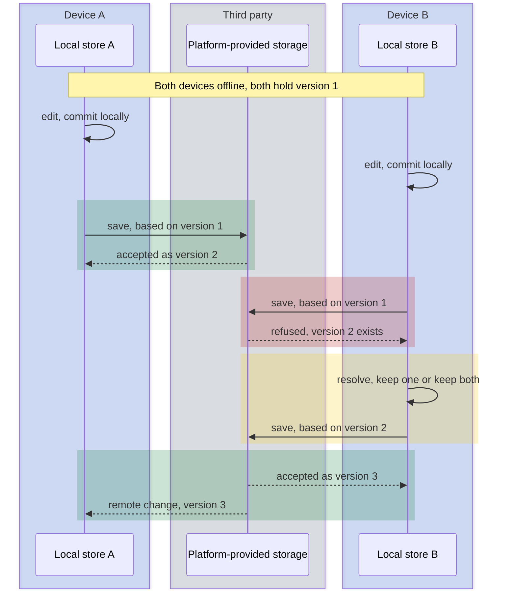
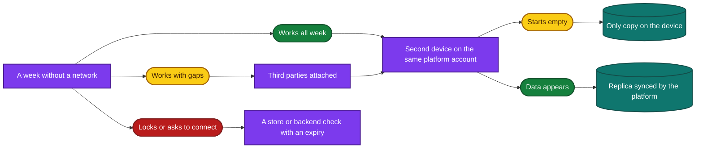

import Probe from '../../../components/Probe.astro';
import Signals from '../../../components/Signals.astro';
import TeardownBar from '../../../components/TeardownBar.astro';
import WorksheetForm from '../../../components/WorksheetForm.astro';

> **The archetype.** An app that does its whole job on the device: a tool, or a keeper of personal data, whose team runs no backend for the user's data and asks for no account.

## 54.1 What defines this archetype

An app with no backend makes one promise. It works the moment you open it, forever, with nothing to sign in to.

Each clause of that promise has a cost.

- **The moment you open it.** No request stands between the tap on the icon and the first useful screen, so every delay is the app's own.
- **Forever.** No service can be switched off and no session can end. The version a user installed years ago still holds their data, and the next version must be able to read it.
- **Nothing to sign in to.** There is no account to attach data or a purchase to. The device is the identity, or the platform account is.

Three concerns dominate the design. Two more shape it from the side.

| Concern | Why it matters here | Chapter |
|---|---|---|
| Local storage | The local store is the only copy of the user's data | [Chapter 11](/part-2-concerns/11-local-storage-caching-and-prefetching/) |
| Hardware | In a camera or sensor tool, the hardware is the product | [Chapter 24](/part-2-concerns/24-location-sensors-and-hardware/) |
| Performance | With no network wait to hide behind, speed is the quality users judge | [Chapter 35](/part-2-concerns/35-performance-and-resource-budgets/) |
| Payments | The app earns through store billing with no backend to verify a receipt | [Chapter 26](/part-2-concerns/26-payments-and-subscriptions/) |
| Observability | The team's only view of the app is whatever third parties report | [Chapter 34](/part-2-concerns/34-observability/) |

The archetype has three variants.

| Variant | Examples | What the device holds |
|---|---|---|
| Pure tool | A calculator, a unit converter, a flashlight, a camera, a level | Settings, and at most a short history |
| Personal data on the device | A journal, a habit tracker, a budget book, a password keeper | Records the user created and cannot recreate |
| Synced through platform storage | Any of the second kind, on several devices of one person | The same records, as a replica that the platform keeps in step |

The third variant is the one that misleads. Data appears on a second device, which looks like a backend, and the app's team runs none. Section 54.6 gives the probe that separates it.

"No backend" is a claim about the app's own data, not about the network. An app of this archetype commonly shows ads, reports crashes and takes payments through the store. Section 54.4 treats those as third parties.

## 54.2 Requirements read from the product

These are requirements as a user experiences them. None of them names a design.

**What the app does**

- Open to a usable screen on the first launch, with no sign-in and no setup that needs a network.
- Do its whole job on the device: compute, capture, record, list, search.
- Keep what the user made, across restarts, updates and years.
- Let the user take their data out, and bring it back in.
- Carry the data to a new device by some path, even if the user has to do it.
- Take a payment once or by subscription, and honor it on a new device.

**Qualities it must have**

- It starts fast and responds at once. A tool that makes you wait is replaced by another tool.
- It works identically with and without a network, today and in five years.
- It never loses a record. An interrupted save, a full disk and an update all leave the data intact.
- It uses little battery, storage and no data that the user would notice.
- It is private by construction. Data that never leaves the device cannot leak from a backend.

Of the seven constraints of [Chapter 2](/part-1-method/2-the-mobile-constraint-set/), the unreliable network does not bind at all. Three bind hard. Process death threatens every write, because no other copy exists. Limited resources set the quality bar. Slow release applies with full force, because old versions and their data stay in use for years and no backend can correct a mistake.

## 54.3 Running the probes

Run the general probes first. They establish that the backend is absent, which is a claim that needs evidence like any other. The probes of this chapter then separate the variants.

### First-pass probes

The first-pass probes of [Chapter 4](/part-1-method/4-probes/) and the component probes of [Chapter 3](/part-1-method/3-the-universal-app-model/) give this archetype an unusual profile.

| Probe | Typical outcome for this archetype | What it tells you |
|---|---|---|
| P4.1 Footprint survey | Stored data is negligible for a tool. For a personal data app it grows with what you create, not with what you browse | No cache filled by visits |
| P4.2 Launch in airplane mode | Content appears and the change is accepted, with no pending indicator | Writes go to the local store and have nowhere else to go |
| P3.1 Offline tour | Everything works and nothing mentions the network | No backend, or a replica. P3.2 separates them |
| P3.2 Second device | No account and no way to move data, or the change appears on devices of the same platform account only | No backend store, or sync through platform-provided storage |
| P4.6 Fresh install | The app starts empty, or has no sign-in at all | The content exists only on the device that created it |

Do not run P4.6 on your main device. Removing an app of this archetype deletes the only copy of its data.

### Probes from Chapter 11

Most probes of [Chapter 11](/part-2-concerns/11-local-storage-caching-and-prefetching/) test a cache, and this archetype has none. Two are worth running for the negative result. P11.4 typically shows a storage figure that hardly moves while you browse and rises only when you create something. P11.5 typically finds no clear-cache control, because nothing on the device can be discarded without loss. P11.8 does not apply. There is nothing to sign out of.

P7.9 and P33.7 matter more here than in any other archetype. They are defined in [Chapter 7](/part-2-concerns/7-launch-and-startup/) and [Chapter 33](/part-2-concerns/33-releases-and-compatibility/), and both watch the first launch after an update. The typical outcomes are "no visible difference" and "everything is there after one long launch". The outcome "content loads from scratch" cannot be a design choice in this archetype, because there is nowhere to load it from. If data is gone after an update, you have found a bug, and it is a serious one.

### Probes from Chapter 24

Run these when the app captures or measures. They are defined in [Chapter 24](/part-2-concerns/24-location-sensors-and-hardware/).

| Probe | Typical outcome | What it tells you |
|---|---|---|
| P24.8 Capture path | A camera inside the app with its own controls | Capture is the product |
| P24.9 Scan offline | The item is recognized and the full result shows offline | Recognition and resolution both run on the device |

### Probes from Chapter 35

These are defined in [Chapter 35](/part-2-concerns/35-performance-and-resource-budgets/), with P7.1 from [Chapter 7](/part-2-concerns/7-launch-and-startup/) for startup.

| Probe | Typical outcome | What it tells you |
|---|---|---|
| P7.1 Cold against warm | Both feel instant | A light cold start that draws from the device |
| P35.1 App size | The app figure stays fixed and every feature opens at once | Everything is bundled |
| P35.3 Battery over a day | Almost all use is on screen | No background work |
| P35.8 Sustained use | Cool for a tool. For a camera, warm, with quality lowered smoothly | Whether the app reads the thermal state |

### Probes from Chapters 26, 27, 34 and 38

These establish the third parties and the money. They are defined in [Chapter 26](/part-2-concerns/26-payments-and-subscriptions/), [Chapter 27](/part-2-concerns/27-ads-attribution-and-growth/), [Chapter 34](/part-2-concerns/34-observability/) and [Chapter 38](/part-2-concerns/38-modularity-sdks-and-team-scale/).

| Probe | Typical outcome |
|---|---|
| P26.1 Read the paywall | Digital goods, billed through your store account |
| P26.5 Restore purchases | It answers at once, or after a store account prompt |
| P26.7 Existing entitlement offline | Paid features work offline |
| P27.2 Ad slots in airplane mode | The slot closes up, or an empty space remains |
| P34.2 Privacy listing | Declares neither, or declares diagnostics only |
| P38.1 Read the licenses screen | A short list |
| P38.2 Read the store's privacy listing | No data collection is declared, or data for advertising is declared |

P23.8 from [Chapter 23](/part-2-concerns/23-background-work-and-notifications/) completes the set for an app with reminders. The typical outcome is a notification that appears on time while offline.

### Probes for this archetype

Eight probes are specific to the archetype. P54.1 is passive and comes first. P54.2 is the decisive probe of the chapter. It takes a week of calendar time, so start it on the first day. P54.3 needs the network on, so it runs in a different week. P54.4 tests the write path. P54.5 to P54.7 find the path to a second device and its conflict behavior. P54.8 finds where a purchase lives.

<TeardownBar />

### P54.1 Read the listing and the settings

<Probe id="P54.1" />

### P54.2 A week without a network

<Probe id="P54.2" />

A ten-minute session in airplane mode cannot replace this probe. Every check with an expiry time passes a short test: a stored unlock, a license for bundled content, a config value kept for a day. Only calendar time makes those rules fire.

### P54.3 Data used after a week

<Probe id="P54.3" />

Sync through platform-provided storage is carried out by the operating system. On many devices its traffic is counted against the system and not against the app, so a synced app can still show a figure near zero.

### P54.4 Kill during a write

<Probe id="P54.4" />

### P54.5 Second device on the same platform account

<Probe id="P54.5" />

### P54.6 Export and import round trip

<Probe id="P54.6" />

### P54.7 Two devices edit offline

<Probe id="P54.7" />

### P54.8 Purchase on a second device

<Probe id="P54.8" />

## 54.4 The design, concern by concern

Each subsection states the design this archetype usually takes and the reason. The components are those of the universal app model in [Chapter 3](/part-1-method/3-the-universal-app-model/).

### What remains of the model

A teardown starts by stating which components an app has. For this archetype the list is short, and the absences do most of the work.

| Component | Pure tool | Personal data on the device | Synced through platform storage |
|---|---|---|---|
| UI, screen state | Present | Present | Present |
| Domain logic | Present, all of it | Present, all of it | Present, all of it |
| Data layer | Thin | Present, local only | Present, and observes changes from sync |
| Local store | Key-value settings, perhaps a history | Present, the only copy | Present, as a replica |
| Network client | Absent, or inside an SDK | Absent, or inside an SDK | Absent in the app's own code |
| Sync engine | Absent | Absent | Supplied by the platform |
| Background workers | Rare | Rare, for reminders and export | Run by the platform for sync |
| Platform services | Present, often the core | Present | Present, and carries the data |
| All backend components except third parties | Absent | Absent | Absent |
| Third parties | Often present | Often present | Present |

Two rows deserve a comment. Domain logic is complete on the client, so a rule can change only with a release. And the network client is absent from the app's own code while an SDK may carry one inside it. The app sends nothing of its own and still appears on the data usage screen.

Each absent component removes chapters from the teardown. [Chapter 10](/part-2-concerns/10-api-shape/), [Chapter 13](/part-2-concerns/13-network-transport-and-resilience/), [Chapter 14](/part-2-concerns/14-real-time-delivery/) and [Chapter 20](/part-2-concerns/20-identity-and-sessions/) are one line each: not applicable, with the probe that showed it.

### The local store as the only copy

In most apps the backend store is the source of truth, and a damaged cache is refetched. Here the local store is the source of truth and the only copy. Four consequences follow.

**Every write must be durable and atomic.** Process death can arrive in the middle of a save. A record that is half written has no good copy elsewhere. The usual design commits each change in a transaction as the user makes it, so that the store moves from one valid state to the next and never rests between them. P54.4 tests this. The kinds of storage in [Chapter 11](/part-2-concerns/11-local-storage-caching-and-prefetching/) apply unchanged: key-value settings for preferences, a local store for records, files for photos and recordings, with the records holding references to the files.

**Every migration must succeed.** A migration converts the local store written by an old version to the shape the new version expects. An app with a backend can discard the local data and fetch it again. This archetype cannot. The migration code for every version ever shipped stays in the app, because a user may update from any of them.

```text
function openStore():
  version = store.schemaVersion()
  if version > Current:
    return WrittenByNewerVersion      // a restored backup or synced data from a newer release
  while version < Current:
    transaction(store):
      migrations[version].apply(store)  // one step per shipped version, never removed
      store.setSchemaVersion(version + 1)
    version = version + 1               // a crash between steps resumes at the next one
  return Ready
```

From outside you see a migration as one long launch after an update, or not at all. You see a failed one as lost data or a crash on every launch.

**Backup is someone else's job, or the user's.** Three paths exist, and an app may have any of them.

| Path | Who runs it | What the user must do | Limit |
|---|---|---|---|
| Device backup | The operating system | Nothing, if device backup is on | Restores only with the whole device, and only what sits in the storage area that backups include |
| Export and import | The app | Remember to export, and keep the file | As recent as the last export |
| Platform-provided storage | The platform | Stay signed in to the platform account | Tied to that account and that platform |

The operating system divides app storage by intent, as [Chapter 11](/part-2-concerns/11-local-storage-caching-and-prefetching/) describes. Data in the area declared as cache is not backed up. A team that puts user records there has made them disposable by mistake. You cannot see the placement directly. You see its effect when a device set up from a backup has the app and not the data.

**A lost device is the test of all three.** With none of the paths, a lost device loses the data, and no support request can bring it back, because the maker never had it. That is the cost of the archetype's privacy. P54.5 and P54.6 tell you which paths an app has, without losing anything. P54.6 also separates an export that is a full backup from one that is only a report for reading.

### Hardware as the product

In a camera, a scanner, a level, a tuner or a step counter, the app is a thin layer over one piece of hardware. [Chapter 24](/part-2-concerns/24-location-sensors-and-hardware/) covers the mechanisms. Three choices are typical here.

- **An in-app camera, not the system's capture screen.** The app draws its own preview and controls, holds the camera permission and manages the camera's lifecycle. An app whose product is capture takes this expensive path. P24.8 shows it.
- **Processing on the device.** Recognition, filtering and measurement run locally, frame by frame. There is no upload, so results are immediate and identical offline. P24.9 confirms it for a scanner.
- **A pipeline with a durable end.** Sensor readings flow from the hardware through processing to the screen and, when the user captures, to a file and a record. The last step is the write path of the previous subsection, and P54.4 tests it for a capture.

Hardware use is tied to the screen. The preview stops when the app leaves the foreground and restarts on return. A step counter is the exception, and it usually reads data the platform has already collected, at almost no battery cost of its own.

Permissions are the gate. A tool whose one function needs the camera can do little without it, so the design question is what its degraded mode offers. The probes of [Chapter 22](/part-2-concerns/22-privacy-permissions-and-consent/) apply directly.

### Performance as the main quality

An app with a backend spends most of its perceived time waiting for the network. This archetype has no such wait. Every delay is processing on the device, and the user compares the app with the system's own tools.

The budgets of [Chapter 35](/part-2-concerns/35-performance-and-resource-budgets/) apply in this order.

- **Startup.** The first frame and the first content are the same moment, because nothing is fetched. A slow launch means too much initialization, often an SDK. P7.1 gives the figure.
- **Frames.** A live preview, a chart that follows a finger or a long list must hold the frame rate. Work that is not drawing stays off the main thread.
- **Heat and battery.** A camera preview with live processing is among the most demanding things a phone does. A careful app reads the thermal state and lowers resolution or frame rate before the operating system forces it. P35.8 shows which happens.
- **Storage and app size.** Captured media grows without limit, and nothing can be evicted, because nothing is a cache. Everything is bundled, so the download size is the whole product.

### Monetization without a backend

There are five ways this archetype earns. Each is visible on the store listing or the paywall.

| Route | What the client must decide | What cannot be enforced |
|---|---|---|
| Paid download | Nothing. The store sells the app | Nothing to enforce |
| One-time unlock | Whether this store account bought the unlock | A determined owner of the device can set the flag |
| Subscription | Whether the subscription is current | The same, and the expiry date depends on the device clock |
| Ads | When and where to show an ad | Whether an ad was truly shown is the ad source's concern |
| Ads with a paid removal | Both of the above | Both of the above |

[Chapter 26](/part-2-concerns/26-payments-and-subscriptions/) describes the normal design: the client sends the receipt to the backend, the backend verifies it with the store and records an entitlement. With no backend, the client checks the receipt itself and keeps a local unlock.

```text
function isUnlocked(product):
  receipt = platformServices.currentReceipt()   // signed by the store, held by the system
  if receipt is missing:
    return localUnlock.lastKnown(product)       // offline, or not yet restored on this device
  if not signatureValid(receipt):
    return false                                // checked by the app itself, on the device
  return receipt.covers(product, now())
```

The design accepts the untrusted client. A flag on the device can be set by the device's owner. For a small app the trade is sound, because a backend built to stop the few who defeat the check would cost more than they do. This handbook does not test the check. P54.8 observes only where an honest purchase lives.

Three visible consequences follow from the missing backend.

- The purchase belongs to the store account, so restore purchases works with no app account.
- The purchase does not cross platforms. Nothing above the two stores holds an entitlement.
- A subscription that lapses is noticed only when the client next reads a fresh receipt. Offline, the local unlock persists until then. P54.2 shows how long.

Ads are the other route, and [Chapter 27](/part-2-concerns/27-ads-attribution-and-growth/) covers them. An ad component is an SDK with its own network client and its own cache. It is often the largest piece of foreign code in the app and the main cause of a slow launch.

### Third parties without a backend

The team that runs no backend still wants to know whether the app crashes, and still wants to be paid. Third parties fill both needs. The usual set is small.

| Third party | How to tell |
|---|---|
| Store billing | A paywall, a restore purchases control |
| Ad source | Visible ads, a declaration in the store listing |
| Crash reports | A diagnostics control, the privacy listing |
| Analytics events | The privacy listing, a consent screen |
| Remote config | Behavior that changes between launches with no update |
| Platform-provided storage | A sync switch that names the platform account |

Three observations separate an app that truly sends nothing from one that sends a little.

1. **The privacy listing and the licenses screen.** The maker declares what is collected and lists what is included. "No data collected" is consistent with no SDKs. It is a statement, and you record it as one. P34.2 and P38.2 read it.
2. **The data usage figure.** Zero after weeks of use is the strongest evidence available that nothing is sent. P54.3 reads it.
3. **Behavior in airplane mode.** An ad slot that closes up, or a paywall that draws without prices, marks the place where a third party sits. P27.2 and P26.4 show these.

A small figure with no ads cannot be split into analytics, crash reports and config. That claim stays Speculative. Crash data can also reach the maker through reports the platform collects, with no SDK in the app at all.

### Sync through platform-provided storage

The third variant gets multi-device sync without a backend. The platform gives each user storage under their platform account, and the app writes to it. The operating system uploads, downloads and notifies the app of remote changes. It comes in three forms.

| Form | What the app stores | Typical conflict behavior |
|---|---|---|
| A small synced key-value area | Settings, a few values | LWW per key, decided by the platform |
| A synced file container | Documents or a whole store as files | The platform keeps both versions and tells the app, which picks one or keeps a marked copy |
| A synced record store | Individual records with change tracking | A save based on an old version is refused, and the app merges fields or takes one side |

In the terms of [Chapter 12](/part-2-concerns/12-offline-and-sync/), each device holds a replica at Level 3, and the sync engine is the platform's. The app's team wrote neither the outbox nor the pull. That changes what they control.

- **Timing.** The operating system decides when to sync. It is prompt on a charged device with a good connection and slow in low-power mode. P54.5 often needs minutes.
- **Quota.** The storage belongs to the user. When the user's platform account is full, sync stops, and the app may not say so.
- **Reach.** The platform account is the only account. The data does not cross to another platform, and there is no web version.
- **Visibility.** The team cannot see any user's data, so it cannot repair it either.

Conflict handling is where the variants differ visibly, and P54.7 exposes it. Syncing a whole store as one file is the simplest design and the most dangerous: two devices that both changed anything conflict on everything, and one side's changes are lost or kept as a second file. Record-level sync conflicts only when the same record changed. Deletions need tombstones here as anywhere. A deleted item that returns after an old device comes back is the standard sign of their absence.

Two designs look alike from outside. An app that syncs through platform-provided storage, and an app that signs you in silently with the platform account to a backend its team runs, both show data on a second device with no visible account. Three signs favor the first: the platform account's storage screen lists the app with a size, the sync switch names the platform account, and the app exists on one platform only. With all three present the claim is Inferred. With none, it is Speculative.

## 54.5 End-to-end architecture

Figure 54.1 shows the components that the probes imply for the fullest variant: a personal data app with platform sync, a paid unlock and ads. There is no backend zone. Delete the third-party nodes that your probes did not find.



*Figure 54.1. An app with no backend. Everything outside the client is a third party.*

Figure 54.2 follows the flow that carries the most risk in the synced variant: two devices change the same record while offline.



*Figure 54.2. A conflict in sync through platform-provided storage. The platform detects it, and the app on the second device resolves it.*

The middle step is the app's own code, and it is the only part of sync the team wrote. An app that skips it leaves the two devices in disagreement, which is the third outcome of P54.7.

## 54.6 Variants and how to tell them apart

The decisive probe is P54.2. A week without a network separates an app that needs nothing from one that needs a little, and both from one that was never of this archetype. Figure 54.3 gives the reading, with P54.5 as the second step.



*Figure 54.3. Reading the two probes that place an app within the archetype.*

**Pure tool against personal data app.** The line is whether the device holds anything the user cannot recreate. Passive observation settles it: a tool's stored data is negligible and stays so. A tool has no backup question and no sync. Its teardown is almost entirely [Chapter 24](/part-2-concerns/24-location-sensors-and-hardware/) and [Chapter 35](/part-2-concerns/35-performance-and-resource-budgets/).

**Only copy against platform sync.** P54.5 separates them, and P54.1 usually predicts the answer. The honest limit from Section 54.4 applies: platform sync and a silent sign-in to the team's own backend can look the same.

**No backend against an optional backend.** Some apps work fully without an account and offer one for sync. Signed out, such an app is of this archetype. Signed in, it is the archetype of [Chapter 48, Notes, documents and collaboration](/part-3-archetypes/48-notes-documents-and-collaboration/), and [Chapter 12](/part-2-concerns/12-offline-and-sync/) applies in full. Record the two states as two teardowns.

**No backend against a thin backend.** A converter that fetches exchange rates has a small read-only data source. P54.2 shows it as reference data that grows old. The app keeps this archetype's client design and adds a cached read from [Chapter 11](/part-2-concerns/11-local-storage-caching-and-prefetching/).

The signal table collects the behaviors from the eight probes and from normal use.

<Signals chapter={54} />

## 54.7 What changes with scale

A backend scales with the number of users. This archetype has none, so a million users cost the team the same as a hundred. Scale shows up elsewhere.

The client design is the same at every size: all domain logic and data on the device, a durable write path, a migration step for every version shipped, and a receipt checked on the device. Four things change.

- **Data per user.** The store grows for as long as the user stays. Queries and lists that were instant at a hundred records need indexes and paging at a hundred thousand. The cost falls on the most loyal users.
- **Versions in the field.** A large installed base contains every version ever released, each holding data in its own shape. The chain of migrations must work from all of them.
- **Third parties.** A small app has one ad source. A large one adds a mediation layer, attribution and more analytics, and its launch slows with each.
- **The pull toward a backend.** Users ask for a second platform, a web version, sharing with another person, or a subscription that follows them. Each needs an identity above the platform account, and that is a backend. The usual first step is an optional account for sync, which turns the local store into a replica without changing the client's write path.

From outside you see the last point as a sign-in screen that can be skipped. The others stay invisible until they fail.

## 54.8 Completed worksheet

[Chapter 6](/part-1-method/6-the-teardown-worksheet/) describes the worksheet and the order in which to fill it in. The fields in this form are specific to the archetype. The probes of Section 54.3 fill most of them.

<TeardownBar />

<WorksheetForm chapters={[54]} />

The fields that [Chapter 3](/part-1-method/3-the-universal-app-model/) adds to the worksheet follow the table in Section 54.4, column by column. The fields of this chapter take these typical values for a personal data app with no sync. A value that differs in your teardown is a finding. Record it with the probe that produced it.

| Chapter 54 field | Typical value | Confidence |
|---|---|---|
| Variant | Personal data on the device | Inferred |
| Account | None | Observed |
| A week without a network | Works indefinitely, or works with third-party gaps | Inferred |
| Network use over a week | None, or small with ads | Inferred |
| Write interrupted by a force-quit | Written as you go | Inferred |
| Path to a second device | Device backup or transfer only, or export and import only | Inferred |
| Export and import | Own format round trip | Observed |
| How the app earns | One-time unlock, or ads with a paid removal | Observed |
| Purchase on a second device | Store account with restore | Inferred |
| First launch after an update | No visible difference | Speculative |

## 54.9 As an interview question

The archetype is rarely asked by name. It arrives as "design a habit tracker", "design a camera app" or "design a notes app, and assume there is no server". It removes the backend that candidates usually spend their time on and leaves the client.

**Clarify first.** Ask four things.

1. Whether the data must reach a second device, and whether platform-provided storage is acceptable for that.
2. How much data one user accumulates over years.
3. Whether the product depends on a piece of hardware.
4. How it earns.

Then state the promise from Section 54.1 in your own words, and say what it rules out.

**Go deep on three concerns.**

- **The local store as the only copy.** Durable, atomic writes. A migration for every shipped version, and what you do when one fails. The three backup paths and what a lost device costs under each. This is where the question is won, because most candidates treat local storage as a cache.
- **Performance.** A launch with no network step. Work kept off the main thread. For a camera, the preview pipeline, the heat budget and what you lower first.
- **Sync without a backend.** The three forms of platform-provided storage, the conflict behavior of each, and what the team gives up: timing, visibility and a second platform. Draw Figure 54.2.

**Trade-offs an interviewer expects to hear.**

- No backend against a small one: privacy, zero running cost and offline by construction, against no recovery, no second platform and no view of users' problems.
- A whole store synced as one file against record-level sync.
- A receipt checked on the device against a backend that verifies it, and why the first is acceptable for a small app.

Name the point at which you would add a backend, and what would change in the client when you do. A good answer is "almost nothing in the write path".

## 54.10 Summary

- An app with no backend promises to work the moment it is opened, forever, with nothing to sign in to. Local storage, hardware and performance dominate its design, with payments and observability at the side.
- Of the universal app model, the client core, the local store and platform services remain. The gateway, services, backend store, change log, async delivery and media delivery are absent. Third parties usually remain.
- The local store is the only copy. Writes must be atomic, every migration must succeed, and backup depends on the device backup, on export and import, or on platform-provided storage.
- In a camera or sensor tool the hardware is the product, processing runs on the device, and performance is the quality users judge.
- The app earns through store billing with a receipt checked on the device, and through ads. The purchase belongs to the store account and does not cross platforms.
- "No backend" is a claim about the app's own data. The privacy listing, the licenses screen, the data usage figure and behavior in airplane mode show which third parties are present.
- Sync through platform-provided storage gives each device a replica without a backend. The platform runs the sync, and the app's own part is conflict resolution.
- The decisive probe is a week without a network. P54.5 then separates the only copy from a synced replica, and P54.7 shows how conflicts resolve.
