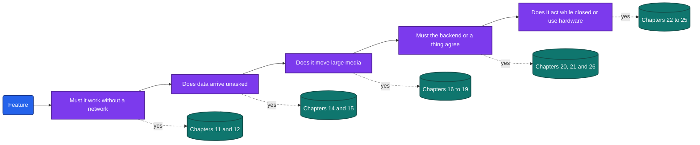
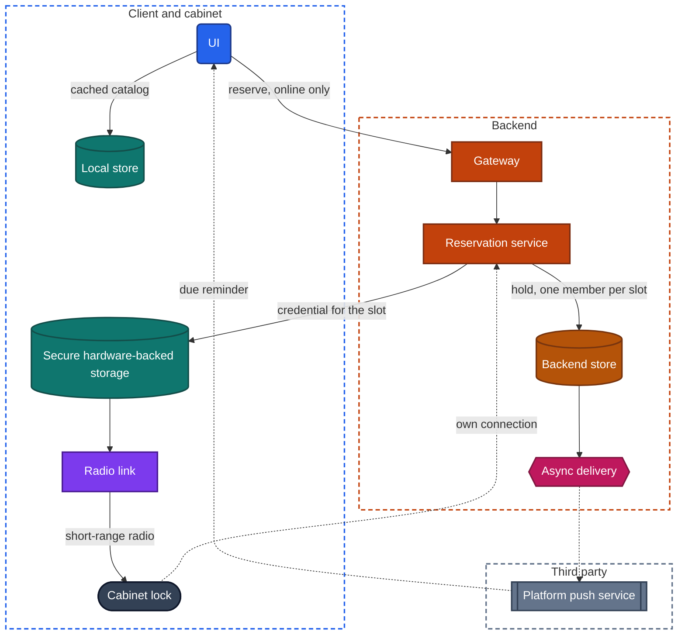
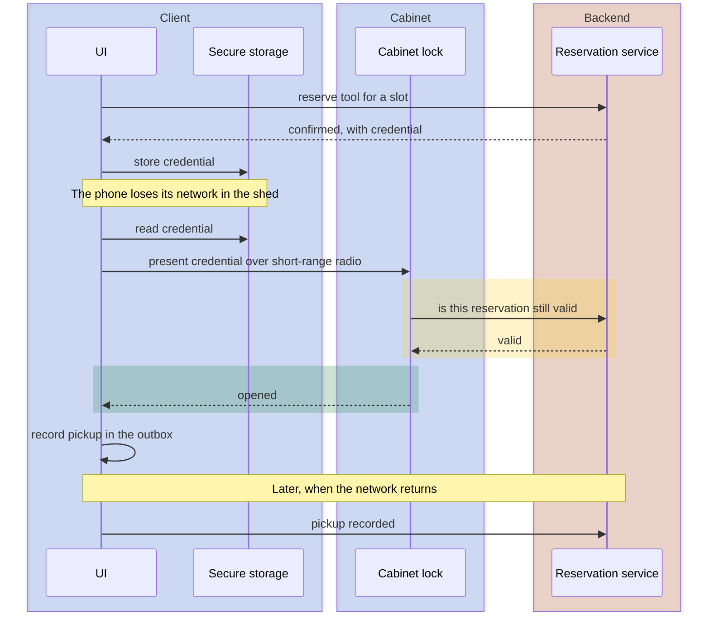

import Probe from '../../../components/Probe.astro';
import Signals from '../../../components/Signals.astro';
import TeardownBar from '../../../components/TeardownBar.astro';
import WorksheetForm from '../../../components/WorksheetForm.astro';

> **The case.** An app that matches none of Chapters 39 to 54 as a whole: a new kind of product, a mix of several archetypes, or a familiar product with something unusual in the loop.

## 55.1 What an archetype gave you, and what is missing now

An archetype chapter does three things for you. It names the concerns that dominate the design. It gives the order in which to run the probes. It states the typical outcome of each probe, so that a different outcome stands out as a finding.

When no archetype fits, you produce those three things yourself. Nothing else changes. The components are still the sixteen of [Chapter 3](/part-1-method/3-the-universal-app-model/). The forces are still the seven constraints of [Chapter 2](/part-1-method/2-the-mobile-constraint-set/). The designs are still the short lists in the design spaces of Part II. An unfamiliar product is a new combination of known problems, and [Chapter 1](/part-1-method/1-reading-apps-from-the-outside/) explains why: the constraints leave only a few workable designs per problem, whatever the product is.

Three kinds of app fit no archetype.

| Kind | Example | What to do |
|---|---|---|
| A mix | A marketplace with chat, payments and delivery tracking | Borrow one archetype per feature. Sections 55.5 and 55.6 |
| A familiar product with an unusual element | A booking app whose booking opens a physical lock | Borrow for the familiar part, and run the method by hand on the rest |
| A new kind of product | Something with no close relative in Part III | Route every feature by its concerns. Section 55.4 |

The unit of work in all three is the feature. [Chapter 5](/part-1-method/5-from-signal-to-inference/) gives the rule: designs are assigned per feature, not per app. An archetype is a shortcut for apps in which one feature dominates. Without the shortcut, you apply the rule directly.

## 55.2 The procedure

The six steps of [Chapter 6](/part-1-method/6-the-teardown-worksheet/) stay in place. Two of them change in content.

| Step of [Chapter 6](/part-1-method/6-the-teardown-worksheet/) | What changes when no archetype fits |
|---|---|
| 1. Identify the app and its features | The archetype guess is "fits no archetype". The feature list carries the weight. Section 55.3 |
| 2. Sketch it against the universal app model | One sketch per feature, because features use different subsets |
| 3. Run the first-pass probes | Run them on each feature in scope, not only on the main screen |
| 4. Go concern by concern through Part II | Choose the chapters by routing each feature. Section 55.4. Borrow the probe order from the nearest archetype. Section 55.5 |
| 5. Sketch the backend | Unchanged. Sketch only what the client implies |
| 6. List open questions | Expect more of them, and record each one |

Within step 4, anything that fits no listed probe outcome goes through the inference chain by hand: signal, then candidate designs, then a discriminating probe, then a claim with a confidence word. In an archetype chapter the chain has been run for you. Here you run it for every unfamiliar feature.

The cost is time. A teardown guided by an archetype chapter spends most of its effort confirming typical values. A teardown from first principles spends it on listing candidates, and it ends with more Speculative claims. That is an accurate result, and [Chapter 5](/part-1-method/5-from-signal-to-inference/) says when to stop.

## 55.3 Splitting an app into features

A feature is one job the app does for the user, with its own data and its own way of failing. "The feed" and "checkout" are features. "The home tab" may be three features on one screen.

Four tests decide where one feature ends and the next begins. Apply them to each line of your list.

1. **Whose data is it?** Data only you see, data shared with named people, and data shared with everyone have different sync and delivery needs.
2. **Which way does it flow?** A feature the user mostly reads and a feature the user mostly writes sit at opposite ends of [Chapter 12](/part-2-concerns/12-offline-and-sync/).
3. **How fast must it be current?** Content that may be an hour old, a status that must be seconds old and a stream that must be live are three different delivery designs.
4. **What decides the outcome?** A feature whose result the client can decide differs from one in which the backend, another person or a physical thing must agree.

When two lines of your list give different answers to any of the four tests, they are two features. P55.1 records the result.

Keep the list short. A full teardown covers three to five features. Choose the one the app exists for, the one that is most unusual, and one ordinary feature for contrast. Write the rest down as out of scope.

## 55.4 Routing a feature to its concerns

An archetype chapter opens with a table of dominant concerns. For an unfamiliar feature you build that table from five questions. Figure 55.1 shows them. A feature passes through all five, and each "yes" adds chapters to its reading list.



*Figure 55.1. Routing one feature. Every feature answers all five questions, and each yes adds the chapters shown.*

The table gives the full routing, with the observation that answers each question.

| Question | How to answer it from outside | Chapters |
|---|---|---|
| Must it work without a network? | P4.2 on this feature | [11](/part-2-concerns/11-local-storage-caching-and-prefetching/), [12](/part-2-concerns/12-offline-and-sync/) |
| Does data arrive unasked? | P4.5 with a second device or account | [14](/part-2-concerns/14-real-time-delivery/), [15](/part-2-concerns/15-lists-feeds-and-pagination/) |
| Does it move large media? | The screen shows images, audio, video or files | [16](/part-2-concerns/16-images/), [17](/part-2-concerns/17-audio-and-video-playback/), [18](/part-2-concerns/18-file-transfer-uploads-and-downloads/), [19](/part-2-concerns/19-live-calls-and-live-streaming/) |
| Must the backend or a thing agree? | An action is refused offline, costs money or needs a proof of identity | [20](/part-2-concerns/20-identity-and-sessions/), [21](/part-2-concerns/21-security-and-trust/), [26](/part-2-concerns/26-payments-and-subscriptions/) |
| Does it act while closed or use hardware? | Permission prompts, notifications, widgets, the battery screen | [22](/part-2-concerns/22-privacy-permissions-and-consent/), [23](/part-2-concerns/23-background-work-and-notifications/), [24](/part-2-concerns/24-location-sensors-and-hardware/), [25](/part-2-concerns/25-platform-surfaces-widgets-wearables-and-extensions/) |
| Does it find or rank things for you? | Search, recommendations, results that differ per account | [28](/part-2-concerns/28-search-and-discovery/), [29](/part-2-concerns/29-personalization-and-on-device-intelligence/) |
| Does it change without an update? | A layout or rule that differs between launches | [30](/part-2-concerns/30-remote-config-and-experiments/), [31](/part-2-concerns/31-server-driven-ui/), [33](/part-2-concerns/33-releases-and-compatibility/) |

Three groups of chapters need no routing. [Chapter 7](/part-2-concerns/7-launch-and-startup/), [Chapter 8](/part-2-concerns/8-navigation-deep-links-and-screen-state/) and [Chapter 9](/part-2-concerns/9-state-and-ui-data-flow/) apply to every app. [Chapter 10](/part-2-concerns/10-api-shape/) and [Chapter 13](/part-2-concerns/13-network-transport-and-resilience/) apply to every feature with a backend. The quality chapters, 34 to 38, apply to the app as a whole and are read once.

A feature with five "yes" answers is not five times the work. Rank the concerns by what the feature's promise depends on, and take the top two or three as dominant. State the promise in one sentence first, as each archetype chapter does in its first section. The clauses of the promise name the concerns.

The signal table routes in the other direction. It starts from a behavior you noticed and gives the chapter and the first probes to run.

<Signals chapter={55} />

## 55.5 Borrowing from the nearest archetype

An unfamiliar app usually contains familiar features. For each one, borrow from the archetype whose dominant feature it resembles.

| The feature resembles | Borrow from |
|---|---|
| A conversation between people | [Chapter 39, Messaging](/part-3-archetypes/39-messaging/) |
| An endless list of other people's content | [Chapter 40, Social feed and stories](/part-3-archetypes/40-social-feed-and-stories/) |
| A catalog with search, a cart and a checkout | [Chapter 43, Marketplace and e-commerce](/part-3-archetypes/43-marketplace-and-e-commerce/) |
| A moving position on a map and a status that advances | [Chapter 44, On-demand services: rides and delivery](/part-3-archetypes/44-on-demand-services-rides-and-delivery/) |
| A scarce thing held for one person for a time | [Chapter 45, Booking and reservations](/part-3-archetypes/45-booking-and-reservations/) |
| Balances and transfers of money | [Chapter 46, Banking, payments and fintech](/part-3-archetypes/46-banking-payments-and-fintech/) |
| A document that one or several people edit | [Chapter 48, Notes, documents and collaboration](/part-3-archetypes/48-notes-documents-and-collaboration/) |
| An accessory that the phone reads or controls | [Chapter 51, Health, fitness and connected devices](/part-3-archetypes/51-health-fitness-and-connected-devices/) |
| A tool that works with nothing but the device | [Chapter 54, Apps with no backend](/part-3-archetypes/54-apps-with-no-backend/) |

Borrowing means three things.

- **Take the probe order.** The archetype chapter's Section 3 lists the Part II probes that matter and the order to run them in.
- **Take the typical values as hypotheses.** Each one is Speculative for your feature until its probe has run. An archetype tells you which candidates to list. It rules none of them out.
- **Record the departures.** A borrowed feature inside a different product rarely gets the full design. Chat inside a marketplace seldom has the local replica of a messaging app. The gap between the typical value and what you observe is the finding.

When a feature resembles two archetypes, borrow from both and note which clause of its promise each one covers.

## 55.6 Recognizing a mix of archetypes

Many apps that seem to fit no archetype fit several. The signs are visible before any deep probe.

- **Offline behavior differs per feature.** One tab shows content and accepts changes in airplane mode, and the next shows an error. P55.2 records this.
- **A seam.** One area looks, scrolls, loads or fails differently from the rest. It was built with a different UI technology or by a different team. P55.3 records this, and [Chapter 32](/part-2-concerns/32-ui-technology-native-cross-platform-and-web/) and [Chapter 38](/part-2-concerns/38-modularity-sdks-and-team-scale/) explain it.
- **Partial failure.** One feature shows an error while the others keep working. [Chapter 3](/part-1-method/3-the-universal-app-model/) reads that as features served separately.
- **Different delivery.** One screen updates while you watch and another needs a refresh.
- **Different trust.** One action asks for a fresh proof of identity and the rest do not.

A mix is torn down in two passes. The first pass treats each feature as a small app of its own archetype. The second examines the places where features meet, because those are the parts no archetype chapter covers.

Three things are usually shared and need examining once.

- **Identity.** One session serves every feature. [Chapter 20](/part-2-concerns/20-identity-and-sessions/) applies to the app.
- **The network client and the gateway.** A session that ends on every screen at the same moment shows one entry point.
- **Notifications.** Every feature competes for the same channel. The notification categories in device settings list the features that send.

The joins between features are where a mix is most informative. A chat about an order must know the order. A booking that opens a door must reach the door. P55.5 tests a join by performing one action and watching every place that should show it. A join made on the client shows the result everywhere at once. A join made on the backend shows it later, often as a message or a notification, and that delay is a signal of two services with async delivery between them.

## 55.7 Probes

Five probes establish the shape of an unfamiliar app. They do not replace the probes of Part II. They decide which of those to run, and on which feature. P55.1 is passive and comes first. P55.4 applies only to an app with a physical step.

<TeardownBar />

### P55.1 Feature inventory

<Probe id="P55.1" />

### P55.2 Airplane-mode tour, feature by feature

<Probe id="P55.2" />

### P55.3 Walk the seams

<Probe id="P55.3" />

### P55.4 Physical step without a network

<Probe id="P55.4" />

### P55.5 One action, every feature

<Probe id="P55.5" />

When no probe in the handbook fits a feature, write one in the format of [Chapter 4](/part-1-method/4-probes/). State the starting condition and the steps. State what to watch. List the outcomes before you run it, and check that at least two candidate designs predict different ones. Keep to the safety rules: your own account, your own devices, data you can afford to lose, and no attempt to get past a protection.

## 55.8 A worked example: a community tool library

The app in this section is invented for the example. No real product is described, and every observation is made up to show the method.

**The product.** A neighborhood shares drills, ladders and saws. The tools sit in cabinets in a shed, and each cabinet has an electronic lock. A member finds a tool in the app, reserves it for a time slot, walks to the shed, opens the cabinet with the phone, and later returns the tool and photographs its condition.

No chapter of Part III describes this app. It is a mix with one unusual element.

### Step 1: features, concerns and the nearest archetype

The promise is: a tool you reserved is yours for the slot, and the cabinet opens for you and for nobody else, even in a shed with a poor signal. The clauses name the concerns: consistency of a hold, trust, hardware, and behavior without a network.

| Feature | Data and people | Dominant concerns | Borrow from |
|---|---|---|---|
| Catalog | Shared, read by all, changes slowly | Lists, search, images, caching | Marketplace and e-commerce |
| Reservation | One tool, one member, one slot | What the backend decides, conflicts between two members | Booking and reservations |
| Unlock | A proof that this member may open this cabinet now | Hardware, trust, offline | Booking for a ticket held offline. Connected devices for the link. Neither fits fully |
| Return report | A photo and a note from one member | File transfer, background work | The media path of Messaging |
| Membership fee | Money | Payments | Marketplace and e-commerce |

The scope is the reservation, the unlock and the catalog. The unlock is the feature the app exists for and the one no archetype covers. The return report and the fee are written down as out of scope.

### Step 2 and step 3: sketch and first-pass probes

The first-pass probes run once per feature in scope. The invented outcomes follow.

| Probe | Catalog | Reservation | Unlock |
|---|---|---|---|
| P4.2 Launch in airplane mode | Earlier content appears | The reserve button is refused with a message | The cabinet opens for an existing reservation |
| P4.5 Second device | Updates after a refresh | A new reservation shows after a return to the app | Not applicable |
| P4.6 Fresh install | Content returns | Reservations return after sign-in | The unlock works after sign-in, online |

P55.2 gives "differs per feature". Three features, three designs. The catalog is a cached read and goes to [Chapter 11](/part-2-concerns/11-local-storage-caching-and-prefetching/). The reservation is online only, which is the usual choice when two people compete for one thing, and it goes to [Chapter 21](/part-2-concerns/21-security-and-trust/) and to the conflict probes of [Chapter 12](/part-2-concerns/12-offline-and-sync/), run with two accounts. The unlock works offline, which no borrowed archetype predicts for an action with a physical result. It gets the inference chain.

### Step 4: the inference chain on the unlock

**Signal.** With a reservation that had begun, the phone in airplane mode and its short-range radio on, a tap on "unlock" opened the cabinet in about two seconds. This happened three times out of three.

**Candidate designs.** The questions of [Chapter 5](/part-1-method/5-from-signal-to-inference/) generate the list: where could the proof have come from, and where is the rule applied.

- **A. The backend commands the lock.** The phone asks the backend, and the backend tells the lock over the lock's own connection.
- **B. The phone carries a credential, and the lock decides alone.** The client fetched a credential when the reservation was made. The lock checks it without asking anyone.
- **C. The phone carries a credential, and the lock asks the backend.** The same radio link, with the lock confirming over its own connection before it opens.

**Discriminating probes.** Write what each candidate predicts.

| Candidate | Phone offline, radio on | Phone online, radio off | Reservation cancelled on a second device while the phone is offline |
|---|---|---|---|
| A. Backend commands the lock | Fails | Opens | Not reachable offline |
| B. Lock decides alone | Opens | Fails | Opens |
| C. Lock asks the backend | Opens | Fails | Refused |

The first column is the signal itself, and it removes A. The second column is P24.10 from [Chapter 24](/part-2-concerns/24-location-sensors-and-hardware/). With the radio off, the app explained what was off and did not open the cabinet. That confirms a direct link and removes A a second time.

The third column separates B from C, and a member can run it on their own reservation. In the invented run, the cabinet stayed shut, and the phone showed a refusal that came from the lock.

**Claims.**

- The cabinet opens with the phone in airplane mode: Observed.
- The phone presents a credential to the lock over a short-range radio, and the backend is not in the phone's path at the moment of unlocking: Inferred. Candidate A was ruled out twice.
- The lock learns of a cancellation without the phone: Inferred, from the refusal. The lock therefore has a path to the backend of its own.
- The lock asks the backend at each unlock: Speculative. A lock that receives a list of cancelled reservations from time to time fits the same refusal, if the list arrived before the attempt.
- The credential has an expiry tied to the slot: Speculative. Not tested, because the test needs a reservation left to run out.

One signal produced claims at all three levels, as in the worked examples of [Chapter 5](/part-1-method/5-from-signal-to-inference/).

### Step 5: the sketch

Figure 55.2 shows the components the probes imply.



*Figure 55.2. The invented tool library. The dotted line from the cabinet lock is Inferred as a path and Speculative as to when it is used.*

Each backend box rests on a client finding, as [Chapter 6](/part-1-method/6-the-teardown-worksheet/) requires. The reservation service is implied by the refusal offline. The backend store is implied by reservations that return on a fresh install. Where the credential is kept on the phone cannot be seen. Secure hardware-backed storage is the fitting home for it, and that box is Speculative.

Figure 55.3 follows the unlock, with the candidate that the probes favor.



*Figure 55.3. The unlock in the invented tool library. The yellow phase is the Speculative part: the lock may instead check a list it received earlier.*

### Step 6: open questions

```text
Question:     Does the lock ask the backend at each unlock?
Candidates:   A check per unlock, or a list of cancellations sent to the lock.
Would settle: A statement from the maker. No probe is available to a member,
              because the lock's connection is not the member's to cut.

Question:     Whose clock ends the credential?
Candidates:   The phone's, the lock's, or the backend's.
Would settle: A reservation left to run out with the phone offline.
              Do not change the device clock to defeat the lock.

Question:     What happens when two members reserve the same slot at once?
Would settle: P12.5 with two accounts whose owners agree.
```

The second question marks a boundary. Setting a clock to see which copy of your own note wins a conflict is a probe. Setting a clock to open a cabinet after your slot has ended is an attempt to defeat a protection, and the method does not include it.

## 55.9 Handling an unfamiliar system in an interview

An interviewer who asks you to design something you have never seen is testing this chapter. The question may be "design the app for a shared tool library" or any product with no well-known reference design. Appendix E, at [/interview/](/interview/), covers how to run the method forwards under a time limit. For an unfamiliar system, six moves carry most of the answer.

1. **State the promise in one sentence.** Ask questions until you can. The clauses of the promise are your requirements, and they name the dominant concerns.
2. **Split into features aloud.** List four or five, and choose the one the product exists for. Say which you will leave out. Use the four tests of Section 55.3.
3. **Name the nearest known system for each feature, and the difference.** "The reservation is a booking. The unlock is like an offline ticket, except that a machine checks it." This shows range, and it keeps you from forcing the whole product into one familiar design.
4. **Walk the seven constraints over the unusual feature.** Ask each one what it does to this feature. A shed with no signal is the unreliable network. A credential on a phone is the untrusted client. This is the fastest way to find the hard part.
5. **Offer the candidates before you choose.** List two or three designs, as Section 55.8 does for the unlock, and say what each costs. Then pick one and say why. Interviewers score the comparison more than the choice.
6. **Mark what you assumed.** The confidence words have a forward form. A requirement the interviewer gave you is a fact. A choice you can defend against its alternatives is a decision. Anything else is an assumption, and you say so.

Treat an unfamiliar component as a box with a contract. You do not need to know how an electronic lock works inside. You need to state what it must answer, what it can reach, and what happens when it cannot. The universal app model has a place for it: it is a second client, or a third party.

Two mistakes are common. The first is to recognize one familiar feature and spend the hour on it, leaving the unusual one untouched. The second is to invent a new mechanism where a known design fits. An unfamiliar product almost never needs an unfamiliar design.

## 55.10 Worksheet

The fields of this chapter record the shape of an app that fits no archetype. Fill them in before the concern fields of Part II, because they decide which of those you need.

<TeardownBar />

<WorksheetForm chapters={[55]} />

For the invented tool library, the fields read as follows.

| Field | Value | Confidence |
|---|---|---|
| Shape of the app | Has an unfamiliar feature | Observed |
| Features | Catalog, reservation, unlock in scope. Return report and fee left out | Observed |
| Dominant concerns | Reservation: what the backend decides. Unlock: hardware, trust, offline. Catalog: caching and lists | Inferred |
| Nearest archetype | Booking and reservations, departing at the unlock | Speculative |
| Offline behavior across features | Differs per feature | Inferred |
| Seams between features | Uniform | Inferred |
| Physical step without a network | Works without a network | Inferred |
| How features share a change | Joined on the backend, for the due reminder | Inferred |
| Probes you wrote | Cancel on a second device while the phone is offline, then unlock | Observed |
| Open questions | Three, in Section 55.8 | |

## 55.11 Summary

- An archetype supplies the dominant concerns, the probe order and the typical outcomes. When no archetype fits, you produce those yourself, and the rest of the method is unchanged.
- The unit of work is the feature. Split the app by whose data it is, which way it flows, how fast it must be current and what decides the outcome.
- Route each feature to Part II by five questions: network, unasked data, media, agreement by the backend or a thing, and work while closed or with hardware. State the feature's promise, and take the two or three concerns it depends on.
- Borrow from the nearest archetype per feature. Its typical values are hypotheses, and the departures from them are findings.
- A mix of archetypes shows as offline behavior that differs per feature, a seam, partial failure and different delivery. Tear down each feature alone, then examine the joins.
- For a feature no chapter covers, run the inference chain by hand: an exact signal, every candidate design, the probe whose outcomes differ, and a claim with its confidence word.
- Record what stays unknown, with its candidates and what would settle it. A probe never tries to defeat a protection.
- This is the whole handbook in one procedure: constraints leave few designs, each design has a signature, and a probe you can run as a normal user tells them apart.
