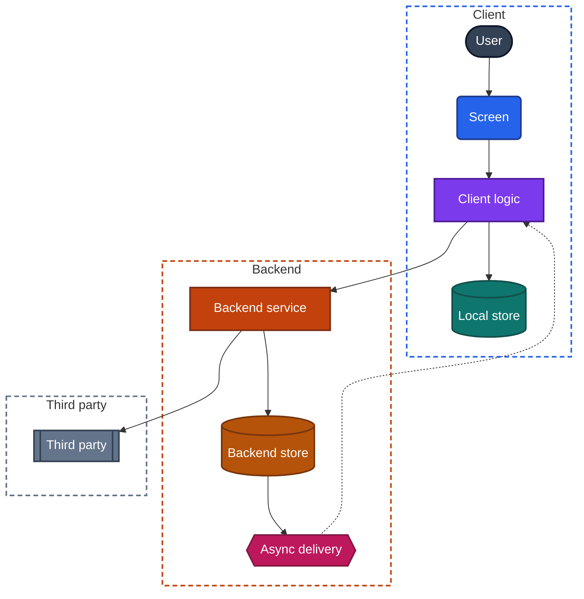
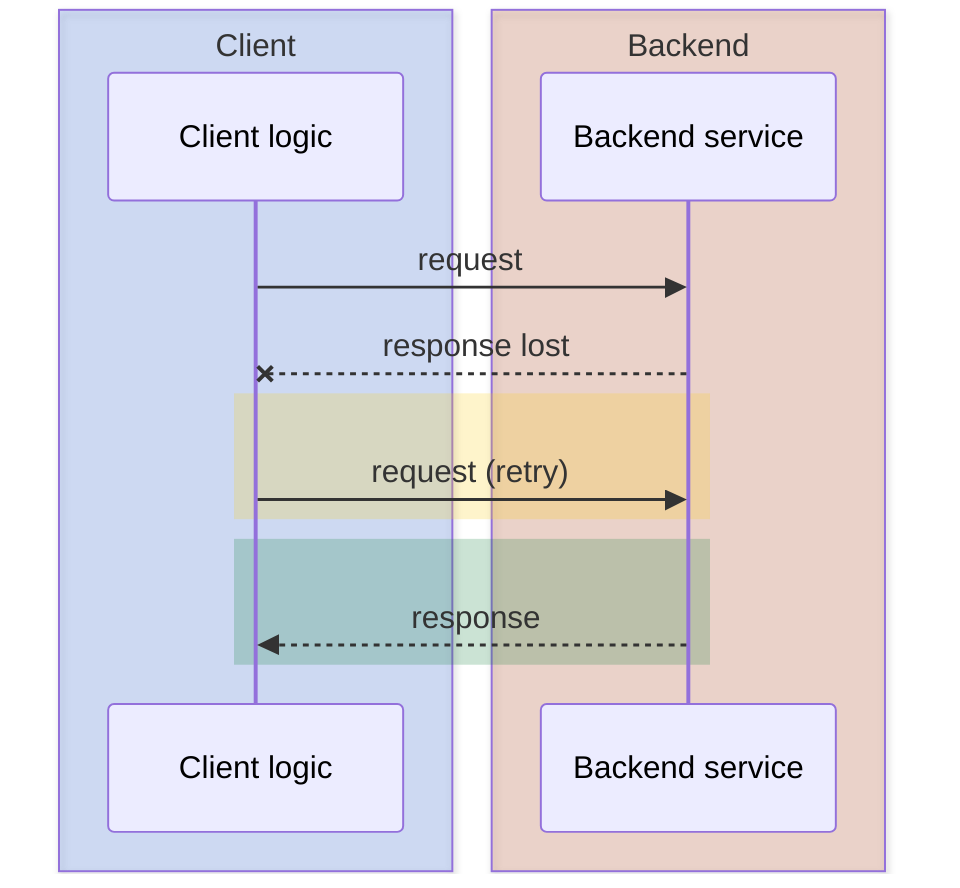

# Diagram kit

Every diagram in the book uses this kit, so that a color and a shape mean the same thing in every chapter. Copy the blocks from this file. Do not invent new colors.

## Roles

A node's color and shape are set by its role, not by the chapter it appears in.

| Role | Class | Color | Shape | Mermaid syntax | Use for |
|---|---|---|---|---|---|
| Person or device | `actor` | Slate `#334155` | Stadium | `A([User])` | The user, a second device, another person |
| Screen | `ui` | Blue `#2563EB` | Rounded | `A(UI)` | Anything the user sees or touches |
| Client logic | `logic` | Violet `#7C3AED` | Rectangle | `A[Sync engine]` | Client components that make decisions |
| Client storage | `store` | Teal `#0F766E` | Cylinder | `A[(Local store)]` | Data kept on the device |
| Backend service | `service` | Orange `#C2410C` | Rectangle | `A[Write API]` | Backend components that handle requests |
| Backend storage | `data` | Amber `#B45309` | Cylinder | `A[(Change log)]` | Data kept on the backend |
| Async delivery | `async` | Pink `#BE185D` | Hexagon | `A{{Push hint}}` | Push, queues, persistent connections |
| Third party | `external` | Gray `#64748B` | Double-edged | `A[[Payment provider]]` | Systems the app's team does not run |

Outcomes use three further classes, in stadium shape. They are used only for results and states, never for components.

| Outcome | Class | Color |
|---|---|---|
| Success | `ok` | Green `#15803D` |
| Failure | `fail` | Red `#B91C1C` |
| Waiting or retrying | `wait` | Yellow `#FACC15` |

## Lines

| Line | Mermaid syntax | Meaning |
|---|---|---|
| Solid arrow | `-->` | A request or a data flow that the sender waits on or performs directly |
| Dotted arrow | `-.->` | An asynchronous signal, a retry or a wake-up |

## Structure diagrams

- Use `flowchart TB` when the diagram has a client zone and a backend zone. The client zone is on top and the backend zone is below it.
- Use `flowchart LR` only for a single chain of steps with no zones.
- Put every node in a zone when the diagram spans client and backend. Zone borders are dashed, blue for the client, orange for the backend, gray for third parties.
- Paste the class block that follows at the end of every flowchart, unchanged, even if some classes are unused.

```text
  classDef actor fill:#334155,stroke:#0F172A,color:#FFFFFF,stroke-width:2px
  classDef ui fill:#2563EB,stroke:#1E3A8A,color:#FFFFFF,stroke-width:2px
  classDef logic fill:#7C3AED,stroke:#4C1D95,color:#FFFFFF,stroke-width:2px
  classDef store fill:#0F766E,stroke:#134E4A,color:#FFFFFF,stroke-width:2px
  classDef service fill:#C2410C,stroke:#7C2D12,color:#FFFFFF,stroke-width:2px
  classDef data fill:#B45309,stroke:#78350F,color:#FFFFFF,stroke-width:2px
  classDef async fill:#BE185D,stroke:#831843,color:#FFFFFF,stroke-width:2px
  classDef external fill:#64748B,stroke:#334155,color:#FFFFFF,stroke-width:2px
  classDef ok fill:#15803D,stroke:#14532D,color:#FFFFFF,stroke-width:2px
  classDef fail fill:#B91C1C,stroke:#7F1D1D,color:#FFFFFF,stroke-width:2px
  classDef wait fill:#FACC15,stroke:#A16207,color:#422006,stroke-width:2px
```

Zone styles, for subgraphs named `CLIENT`, `BACKEND` and `THIRD`:

```text
  style CLIENT fill:none,stroke:#2563EB,stroke-width:2px,stroke-dasharray:6 4
  style BACKEND fill:none,stroke:#C2410C,stroke-width:2px,stroke-dasharray:6 4
  style THIRD fill:none,stroke:#64748B,stroke-width:2px,stroke-dasharray:6 4
```

### Example



## Sequence diagrams

Mermaid cannot color individual participants, so sequence diagrams carry the same colors through zones.

- Group participants in `box` zones, in this order from left to right: client, backend, async delivery, third party.
- Highlight a phase of the interaction with a `rect`, using the outcome colors.
- Solid arrows (`->>`) are requests. Dashed arrows (`-->>`) are responses. A cross (`--x`) is a message that was lost.

| Zone or phase | Syntax |
|---|---|
| Client zone | `box rgba(37, 99, 235, 0.18) Client` |
| Backend zone | `box rgba(194, 65, 12, 0.18) Backend` |
| Async delivery zone | `box rgba(190, 24, 93, 0.18) Async delivery` |
| Third-party zone | `box rgba(100, 116, 139, 0.18) Third party` |
| Success phase | `rect rgba(21, 128, 61, 0.22)` |
| Failure phase | `rect rgba(185, 28, 28, 0.22)` |
| Waiting or retry phase | `rect rgba(250, 204, 21, 0.22)` |

### Example



## Why these choices

- Fills are solid with white text, and zones are transparent tints, so every diagram is readable on both light and dark pages.
- Shape repeats what color says, so the diagrams still work for readers who cannot tell the colors apart, and in black-and-white print.
- Green, red and yellow are reserved for outcomes, so they never mean a component.
